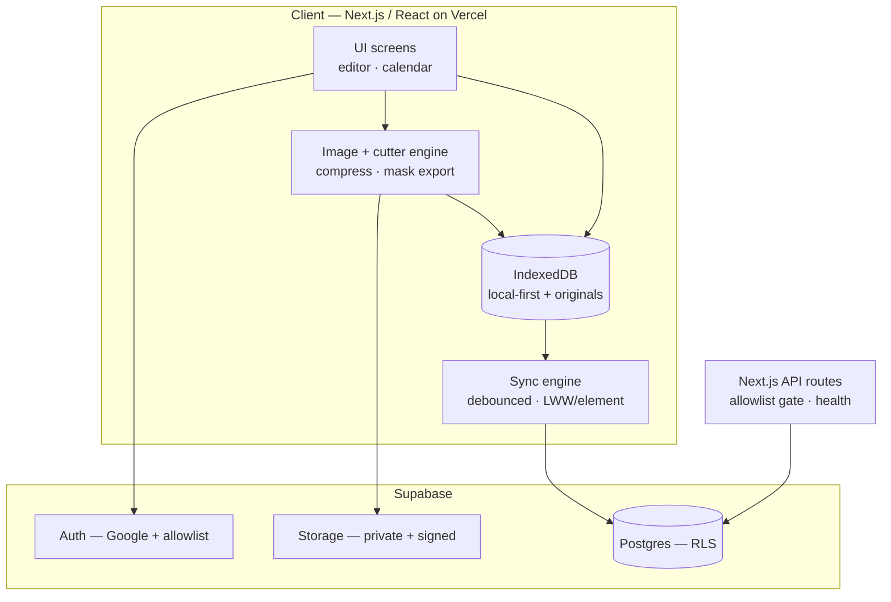
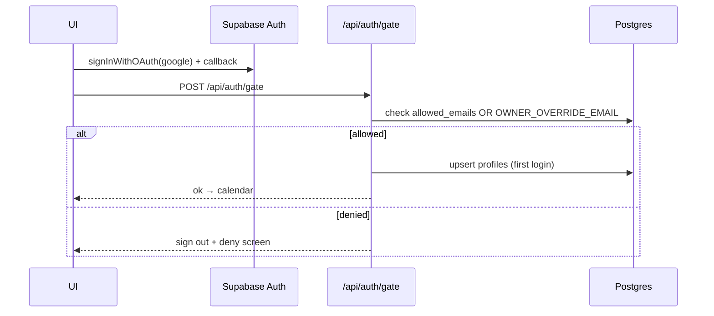
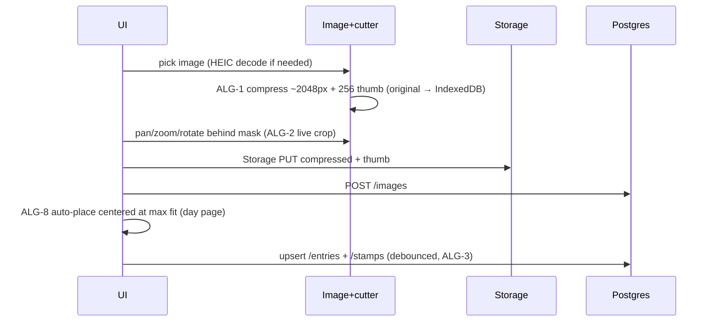
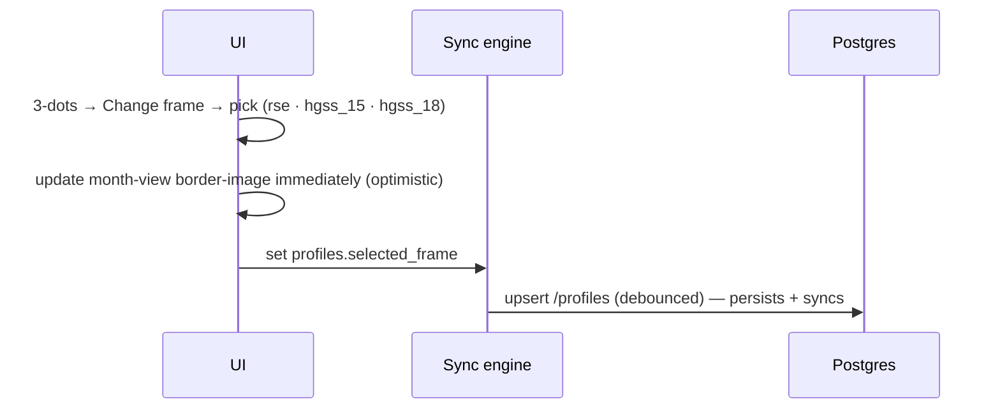

# Javi's Journal — Technical Design

Local-first, phone-first scrapbook-journal web app. Every edit renders instantly from
**IndexedDB**; a **debounced sync engine** reconciles to **Supabase** in the background
with **last-write-wins per element**. Only compressed images (~2048px) + 256px thumbnails
live in the cloud; the uncompressed original stays client-side. The signature stamp cutter
uses **canvas-based masking** (not CSS `clip-path`) for Safari/iOS consistency.

## Intra-App Interactions

The client (Next.js/React on Vercel) is the whole app: UI screens write to a local-first
IndexedDB store and render from it immediately; a sync engine debounces writes up to
Supabase Postgres; the image + cutter engine compresses/masks photos and uploads
compressed + thumbnail blobs to Supabase Storage. Two thin Next.js API routes handle the
allowlist sign-in gate and a cron health ping. Supabase provides Auth (Google + allowlist),
Postgres (RLS `auth.uid() = user_id`), and Storage (private bucket + signed URLs).



### Key flows

**FLOW-1 — Sign in, locked to Javi (US-1)**



**FLOW-2 — Add first photo → cut → place (US-6, US-7)**



**FLOW-3 — Add 2nd & 3rd stamps (US-8)**

```mermaid
sequenceDiagram
  participant UI
  participant IMG as Image+cutter
  participant ST as Storage
  participant PG as Postgres
  UI->>UI: tap day → day canvas (close-up), adjacent days peeking
  UI->>UI: tap floating + FAB (bottom-right; hidden at 3 stamps)
  UI->>IMG: pick image → ALG-1 compress → stamper cut (ALG-2)
  UI->>ST: Storage PUT
  UI->>PG: POST /images
  UI->>UI: place at ~60% max-fit, cascade-offset, layer_order = max+1
  UI->>PG: upsert /stamps (entry exists) — debounced (ALG-3)
```

**FLOW-4 — Edit a day that already has stamps (US-8)**

```mermaid
sequenceDiagram
  participant UI
  participant IDB as IndexedDB
  participant PG as Postgres
  UI->>UI: tap day with stamps → Day page (close-up)
  UI->>UI: tap to select · drag to move · long-press → menu (ALG-9)
  UI->>IDB: edit transform / layer_order (optimistic)
  UI->>PG: debounced sync (ALG-3)
  Note over UI: Delete → "Deleted — Undo" toast; on commit set deleted_at (ALG-4)
```

**FLOW-5 — Silent optimistic autosave (US-11)**

```mermaid
sequenceDiagram
  participant UI
  participant IDB as IndexedDB
  participant SYNC as Sync engine
  participant PG as Postgres
  UI->>IDB: write + set client updated_at (instant, no spinner)
  UI->>UI: re-render immediately
  IDB->>SYNC: mark dirty; debounce ~800ms / gesture-end
  SYNC->>PG: batch PK upsert
  Note over SYNC: offline/error → keep dirty, "offline — will sync", backoff retry
```

**FLOW-6 — Cross-device pull + LWW merge (US-11)**

```mermaid
sequenceDiagram
  participant SYNC as Sync engine
  participant PG as Postgres
  participant ST as Storage
  participant IDB as IndexedDB
  SYNC->>PG: pull rows where updated_at > cursor (per table, ALG-4)
  SYNC->>PG: GET /images to resolve image_id → storage/thumb paths
  SYNC->>ST: createSignedUrl(s) (originals not on this device)
  SYNC->>IDB: reconcile per element (remote-newer wins; deleted_at removes)
```

**FLOW-7 — Zoom close-up ↔ full-month (US-2, US-3)** — pure client view-state, no fetch:
pinch-out → smooth scale to the full-month grid (Monday-start, ALG-5, fixed side margin);
pinch-in / tap → back to close-up or into a day. Desktop defaults to full-month. Mounts
current ±1 month only (ALG-6).

**FLOW-8 — Change calendar frame (US-10)**



**FLOW-9 — Month render from thumbnails (US-2, US-3, US-13)** — load entries for the visible
month range, mount current ±1 month only (ALG-6); each day renders a 256px thumb (object URL
from IndexedDB or signed Storage URL), never full-res; off-screen cells unmount and revoke
object URLs so memory stays flat (fixes the ~20-day freeze).

**FLOW-10 — Download PNG (US-12)** — compose the month offscreen at 2× (9-slice frame + grid
+ thumbs + global stickers, ALG-7), chunked via `requestIdleCallback` so the editor never
blocks, then `convertToBlob` → download.

## Backend API Surface

Supabase data ops go through PostgREST with RLS (`auth.uid() = user_id`); auth and storage
use the Supabase SDK; two custom Next.js route handlers cover the sign-in gate and health
ping. "UPSERT" rows are PK/uniqueness upserts driven by the sync engine.

| Method | Path | Purpose | Request | Response | Auth | Tables | Serves |
|--------|------|---------|---------|----------|------|--------|--------|
| SDK | `auth.signInWithOAuth(google)` | Google login + callback | provider | session | public → session | (auth.users) | US-1 |
| POST | `/api/auth/gate` | Allowlist/override check, provision profile | session | ok / deny | session | allowed_emails (r), profiles (w) | US-1 |
| GET | `/api/health` | Cron warm-ping (avoid free-tier pause) | — | 200 | secret header | — | US-13 |
| GET | `/entries?entry_date=gte..lte` | Month range load | date range | entries[] | yes | entries | US-2, US-3 |
| UPSERT | `/entries` (on user_id,entry_date) | Create/touch a day | entry | entry | yes | entries | US-7, US-11 |
| GET | `/stamps?entry_id=in / updated_at=gt` | Day stamps + sync delta | ids / cursor | stamps[] | yes | stamps | US-7, US-8, US-11, US-13 |
| UPSERT | `/stamps` (batch, on id) | Create/update stamp + transform | stamp[] | stamp[] | yes | stamps | US-6, US-7, US-8, US-11 |
| PATCH | `/stamps` (soft: set deleted_at) | Delete stamp (undo toast) | id, deleted_at | stamp | yes | stamps | US-8 |
| GET | `/sticker_assets` | Load reusable tray | — | assets[] | yes | sticker_assets | US-9 |
| POST | `/sticker_assets` | Add uploaded sticker to tray | asset | asset | yes | sticker_assets | US-9 |
| DELETE | `/sticker_assets` (guard is_seeded) | Remove tray sticker | id | ok | yes | sticker_assets | US-9 |
| GET | `/placed_stickers?updated_at=gt` | Global layer + sync delta | cursor | placed[] | yes | placed_stickers | US-9, US-11 |
| UPSERT | `/placed_stickers` (on id) | Place/move/resize/rotate | placed[] | placed[] | yes | placed_stickers | US-9, US-11 |
| PATCH | `/placed_stickers` (soft: deleted_at) | Remove placed sticker | id, deleted_at | placed | yes | placed_stickers | US-9 |
| GET | `/images?id=in.(...) / created_at=gt` | Resolve image_id → storage/thumb paths (sync + 2nd device) | ids / cursor | images[] | yes | images | US-6, US-9, US-11, US-13 |
| POST | `/images` | Register row after upload | image | image | yes | images | US-6, US-7, US-9, US-13 |
| GET | `/profiles` | Load settings | — | profile | yes | profiles | US-4, US-10 |
| UPSERT | `/profiles` | Week-start · frame · fireworks_seen | profile | profile | yes | profiles | US-4, US-10 |
| PUT | `storage: images/{uid}/{id}.jpg\|.png + thumb` | Upload compressed + thumb (private bucket) | blob | path | yes (storage RLS) | (Storage) | US-6, US-7, US-9, US-13 |
| GET | `storage: createSignedUrl(s)` | Signed URL for thumb/compressed (cached) | path(s) | url(s) | yes | (Storage) | US-2, US-3, US-6, US-9 |

Notes:
- The `PATCH … deleted_at` rows depend on a schema addition — see Open Technical Questions.
- `GET /images` is required because a second device pulls `stamps`/`placed_stickers` that
  reference an `image_id` but does not hold the originals; it resolves them to
  `storage_path`/`thumb_path` to build signed URLs.

## Algorithms

### ALG-1 — Client image pipeline
- **Purpose / trigger:** on every photo/sticker upload — the "no freeze" fix + upload-size fix.
- **Runs on:** client.
- **Inputs → outputs:** a picked `File` (often 8–20MB HEIC/JPEG) → `{ mainBlob (~2048px, JPEG q0.8 for photos / PNG for stickers), thumbBlob (256px), width, height }`. The uncompressed original is kept in IndexedDB and never uploaded.
- **Approach:** transcode HEIC → JPEG (iPhone default, since Chrome/Firefox can't decode HEIC), decode via `createImageBitmap` with `imageOrientation:'from-image'` to bake EXIF rotation, stepped-halving downscale for sharpness, encode via `convertToBlob`. Stickers keep PNG alpha.
- **Pseudocode:**
  ```
  processImage(file, kind):            # 'photo' | 'sticker'
    if isHeic(file): file = await heicToJpeg(file)   # heic2any / libheif-wasm
    bmp = await createImageBitmap(file, {imageOrientation:'from-image'})
    [cw,ch] = fit(bmp.w, bmp.h, 2048)                # longest edge ≤ 2048
    main = stepDownDraw(bmp, cw, ch)                 # halving passes = sharp
    type = kind=='sticker' ? 'image/png' : 'image/jpeg'
    mainBlob  = await main.convertToBlob({type, quality:0.8})
    thumbBlob = await drawTo(main, fit(cw,ch,256)).convertToBlob({type})
    bmp.close(); release(main)                        # free memory
    return {mainBlob, thumbBlob, width:cw, height:ch}
  ```
- **Complexity / performance:** O(pixels); stepped downscale trades a few extra passes for far better quality. Close bitmaps promptly to keep memory flat.
- **Edge cases:** HEIC on non-Safari; portrait/landscape EXIF orientation; very large images on low-end phones (cap decode); transparent stickers must stay PNG.
- **Libraries:** `heic2any` or `libheif-wasm`; `createImageBitmap` / `OffscreenCanvas`.

### ALG-2 — Stamp cutter transform + canvas-mask export
- **Purpose / trigger:** the signature feature — fit a photo behind a shape mask and cut a non-destructive stamp.
- **Runs on:** client.
- **Inputs → outputs:** source image + mask id + normalized crop `{offX, offY, scale}` → a masked stamp canvas; the crop is stored on the `stamps` row (never a baked cutout).
- **Approach:** the **invariant** that kills the "shifted after cutting" bug — the crop lives in **normalized source-pixel space** as the single source of truth; both the live preview and the export derive from it. Export at a fixed `OUT` resolution (DPR-independent) and apply the mask via canvas `globalCompositeOperation='destination-in'` with an alpha-mask bitmap (not CSS `clip-path`, which is inconsistent on Safari/iOS for heart / scallop / postage edges); the postage frame is drawn `source-over` on top.
- **Pseudocode:**
  ```
  renderStamp(img, mask, crop, OUT=512):     # crop.offX/offY/scale ∈ source
    outH = OUT * mask.aspect
    srcW = crop.scale*img.w;  srcH = srcW*(outH/OUT)
    sx = crop.offX*img.w - srcW/2;  sy = crop.offY*img.h - srcH/2
    ctx.drawImage(img, sx,sy,srcW,srcH, 0,0,OUT,outH)
    ctx.globalCompositeOperation='destination-in'
    ctx.drawImage(mask.alpha[id], 0,0,OUT,outH)          # cloud/heart/spiky/circle…
    if mask.frame: ctx.gCO='source-over';
                   ctx.drawImage(mask.frame,0,0,OUT,outH) # postage edge
    return canvas    # OUT fixed ⇒ DPR-independent; preview derives FROM crop
  # live pan:  s=winDisplayW/(crop.scale*img.w); crop.offX -= dx/s/img.w
  # live zoom: crop.scale = clamp(crop.scale/f, minFit, 1)
  ```
- **Complexity / performance:** O(output pixels) per render; cheap enough for live preview.
- **Edge cases:** image smaller than the mask window (clamp min scale); DPR change between preview and export (avoided by fixed `OUT`); re-fitting later loads the compressed cloud image (the cross-device source of truth), not the original.
- **Libraries:** Canvas 2D / `OffscreenCanvas`; pre-rendered alpha-mask + frame bitmaps per shape.

### ALG-3 — Optimistic autosave + debounced push
- **Purpose / trigger:** every edit — "the app never makes her wait."
- **Runs on:** client.
- **Inputs → outputs:** an edited element → instant IndexedDB write + eventual Postgres upsert.
- **Approach:** write locally and re-render immediately with a client-authored `updated_at` (the LWW clock); debounce a batched flush to gesture-end / ~800ms idle; on failure keep the dirty set and retry with backoff, surfacing a subtle "offline — will sync" hint.
- **Pseudocode:**
  ```
  onEdit(el):
    el.updated_at = Date.now()          # LWW clock (client-authored)
    idb.put(el); markDirty(el); render()          # optimistic, no spinner
    debounce(flush, 800ms, {onGestureEnd:true})
  flush():
    for table, rows in groupByTable(dirty):
      try: supabase.from(table).upsert(rows)       # PK upsert
           clearDirty(rows)
      catch: keep dirty; show "offline — will sync"; backoff-retry
  ```
- **Complexity / performance:** batched network writes, one round-trip per flush per table.
- **Edge cases:** rapid gesture streams (debounce to gesture-end); partial batch failure (keep only failed rows dirty).

### ALG-4 — Pull + last-write-wins reconciliation
- **Purpose / trigger:** on app open / focus / periodic — cross-device sync.
- **Runs on:** client.
- **Inputs → outputs:** per-table `updated_at` cursor → merged IndexedDB state.
- **Approach:** incremental delta pull; per element, remote-newer wins, local-dirty-and-newer is kept (pending push wins), equal timestamps break ties by higher id (deterministic on both devices); `deleted_at` tombstones propagate deletes.
- **Pseudocode:**
  ```
  pull():
    for t in [entries, stamps, placed_stickers, profiles]:
      rows = supabase.from(t).select().gt('updated_at', cursor[t]).eq('user_id', me)
      for r in rows:
        local = idb.get(t, r.id)
        if !local or r.updated_at > local.updated_at:
          r.deleted_at ? idb.delete(t,r.id) : idb.put(t,r)
        # local dirty & newer → keep
      cursor[t] = max(seen updated_at)
    # tie (equal ts): higher id wins
  ```
- **Complexity / performance:** delta-scoped by the `(user_id, updated_at)` indexes.
- **Edge cases:** clock skew across devices (accepted for a single user on synced clocks); delete resurrection (solved by tombstones); referenced images resolved via `GET /images` + signed URLs.
- **Libraries:** supabase-js; IndexedDB (idb / Dexie).

### ALG-5 — Calendar grid with configurable week-start
- **Purpose / trigger:** rendering any month; changing start-of-week (US-4).
- **Runs on:** client.
- **Inputs → outputs:** `(year, month, startOfWeek)` → rows of 7 day-cells (with leading/trailing blanks).
- **Approach:** compute leading blanks from the ISO day-of-week of the 1st relative to the chosen start; pad to whole weeks. Re-lays-out on change; the choice persists via `profiles`.
- **Pseudocode:**
  ```
  monthGrid(year, month, startOfWeek):   # 1=Mon .. 7=Sun
    lead = (isoDow(firstOfMonth) - startOfWeek + 7) % 7
    cells = [null]*lead + [1..daysInMonth]
    while cells.length % 7: cells.push(null)      # pad trailing
    return chunk(cells, 7)                        # 5–6 rows
  ```
- **Edge cases:** months starting on the chosen start-day (lead = 0); 28–31 day months (5 vs 6 rows).

### ALG-6 — History virtualization + memory lifecycle
- **Purpose / trigger:** always, while browsing — the direct fix for the ~20-day freeze.
- **Runs on:** client.
- **Inputs → outputs:** the visible month → mounted cells with 256px thumbnails; off-screen cells released.
- **Approach:** mount only the current ±1 month; render 256px thumbnails only (object URL from IndexedDB or signed Storage URL); revoke object URLs on unmount; decode full-res originals only inside the stamper, then close the bitmap; LRU-cap decoded thumbs; never keep every day's canvas mounted.
- **Pseudocode:**
  ```
  renderMonth(m):
    for day in m.visibleDays:            # current ±1 month mounted
      src = cache.get(day.imageId) ?? URL.createObjectURL(idb.thumbBlob(day.imageId))
             # 256px only, never full-res
  onUnmount(cell): URL.revokeObjectURL(cell.objURL)   # release memory
  ```
- **Complexity / performance:** memory stays ~flat regardless of history length — the hard gate is the simulated 30–60 day long-run test.
- **Edge cases:** fast scrolling (LRU + lazy decode); missing thumb (fall back to signed Storage URL).

### ALG-7 — PNG export composition
- **Purpose / trigger:** 3-dots → Download PNG (US-12).
- **Runs on:** client.
- **Inputs → outputs:** the current month view → a downloaded PNG including frame, stickers, and thumbnails.
- **Approach:** compose offscreen at 2× — rasterize the 9-slice `border-image` frame onto the canvas, draw the grid + day thumbnails, then the global stickers in calendar coordinates; chunk decode/draw with `requestIdleCallback` so the editor never blocks; `convertToBlob` → download.
- **Pseudocode:**
  ```
  exportPNG(month):
    cv = OffscreenCanvas(W*2, H*2)
    draw9Slice(cv, frameAsset)               # rasterize border-image
    for cell in month.grid:
       await drawThumb(cv, cell.thumbBlob, cell.rect)
       if idleBudgetExceeded(): await nextIdle()   # requestIdleCallback
    for s in placedStickers: drawSticker(cv, s)     # global calendar coords
    download(await cv.convertToBlob({type:'image/png'}))
  ```
- **Edge cases:** manual 9-slice math for the frame (CSS `border-image` doesn't apply to canvas); large months chunked to stay responsive.

### ALG-8 — Auto-place + 3-cap + layer order
- **Purpose / trigger:** placing a freshly cut stamp (US-7, US-8).
- **Runs on:** client (a Postgres `BEFORE INSERT` trigger also enforces the cap).
- **Inputs → outputs:** `(entry, stamp)` → the stamp positioned on that day's page with a `layer_order`.
- **Approach:** `entry` is the tapped day-page (`entries` row); the stamp binds to it via `entry_id`, and `pos`/`scale` are **normalized to the day page**, so a stamp can never spill onto the whole calendar. The first stamp is centered at max fit; the 2nd/3rd enter smaller (~60%) and cascade-offset so they don't fully cover; newest lands on top via `layer_order = max+1`. Front/back adjust `layer_order`.
- **Pseudocode:**
  ```
  placeStamp(entry, stamp):              # entry = the tapped day (entries row)
    n = countStamps(entry.id)            # scoped to THIS day via entry_id
    if n >= 3: return reject()           # + hidden at 3
    stamp.entry_id = entry.id            # binds the stamp to that day ONLY
    if n == 0:                           # first stamp
       stamp.pos   = {x:0.5, y:0.5}                  # centered on the day page
       stamp.scale = maxFit(stamp.aspect, dayPage.aspect, margin)
    else:                                # 2nd / 3rd stamp
       stamp.scale = 0.62 * maxFit(stamp.aspect, dayPage.aspect, margin)
       stamp.pos   = cascade({x:0.5,y:0.5}, n)       # offset so it doesn't cover
    stamp.rotation    = 0
    stamp.layer_order = maxLayer(entry.id) + 1       # newest lands on top
  # pos/scale are day-page normalized, NOT calendar → confined to the day
  bringToFront(s): s.layer_order = maxLayer+1; touch(s)
  sendToBack(s):   s.layer_order = minLayer-1; touch(s)
  ```
- **Edge cases:** 4th insert rejected on client and DB; aspect ratios wider/taller than the day page (max-fit respects both).

### ALG-9 — Phone gesture disambiguation
- **Purpose / trigger:** all touch interaction on the editor — the #1 phone design risk.
- **Runs on:** client.
- **Inputs → outputs:** pointer events → one of: select (tap), move (drag), long-press menu, or canvas pan.
- **Approach:** on pointer-down, hit-test the top element by `layer_order`; a down on an already-selected element arms a long-press timer and a "maybe-drag"; movement past an 8px slop cancels the timer and becomes a drag; a down on empty space pans the calendar. Resize/rotate live in the long-press menu (not ambient handles), removing the resize-drag-vs-pan conflict. The floating **+** FAB is a fixed control outside the gesture surface. `touch-action: none` on elements prevents the browser stealing the gesture.
- **Pseudocode:**
  ```
  onDown(p):
    hit = topElementAt(p)                 # highest layer_order under point
    if hit && hit.selected: mode='maybeDrag'; timer(LONGPRESS=500)
    elif hit: select(hit); mode='tap'
    else: mode='canvasPan'                # empty area → scroll calendar
  onMove(p):
    if mode=='maybeDrag' && dist(p,start)>SLOP(8): cancelTimer; mode='drag'
    drag→moveElement(hit,p);  canvasPan→scroll(p)
  onLongPress(): if mode=='maybeDrag': openMenu(hit)  # Resize·Rotate·F/B·Delete
  onUp(): if mode=='tap': commitSelect(hit)
  ```
- **Edge cases:** overlapping stamps (top by `layer_order`); accidental micro-drags (slop threshold); must be validated on a real device, not just a desktop mobile emulator.

## Open Technical Questions

- **Delete propagation (schema addition needed).** SCHEMA.md's `stamps` and `placed_stickers`
  have no `deleted_at`; the LWW sync (ALG-4) relies on a nullable `deleted_at timestamptz`
  tombstone on both so deletes propagate across devices instead of resurrecting on pull. This
  is the one change that reaches back into the schema — reconcile SCHEMA.md (a follow-up
  `/idea-db` pass) to add `deleted_at` to `stamps` and `placed_stickers`, and include it in
  the incremental-sync indexes.
- **Resolved during review:** HEIC decode (transcode on non-Safari, primary user on iPhone);
  storage privacy (private bucket + signed URLs); LWW clock skew (accepted client-authored
  `updated_at`); global sticker coordinates (normalized to the full-month grid bounding box,
  `scale` normalized to grid width, so positions are identical across close-up / full-month /
  2× PNG export).
- **`+` FAB placement.** Matched to the annotated screenshot (bottom-right); revisit if a
  bottom-left position reads better one-handed.
