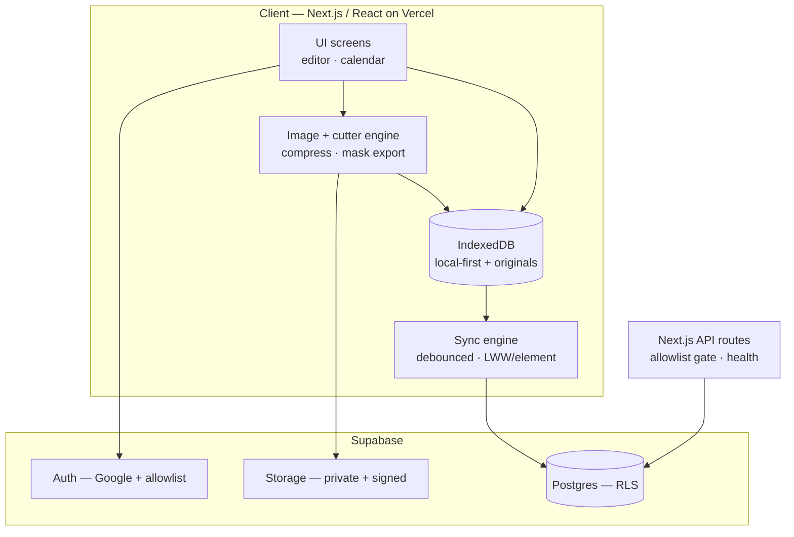
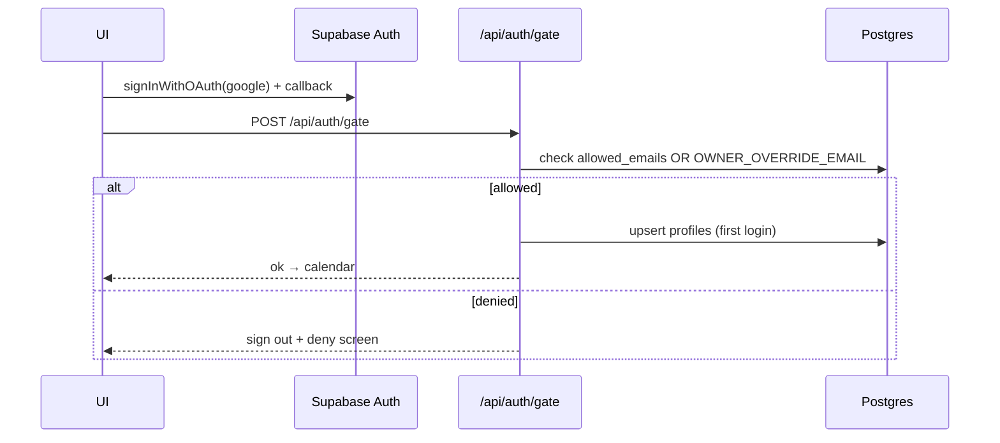
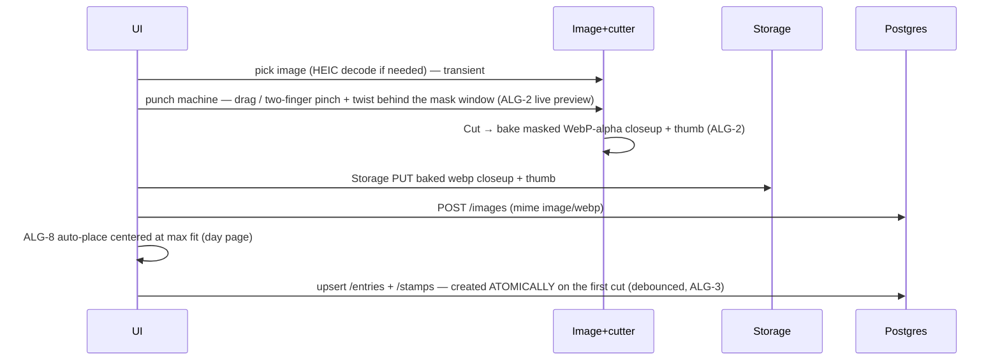
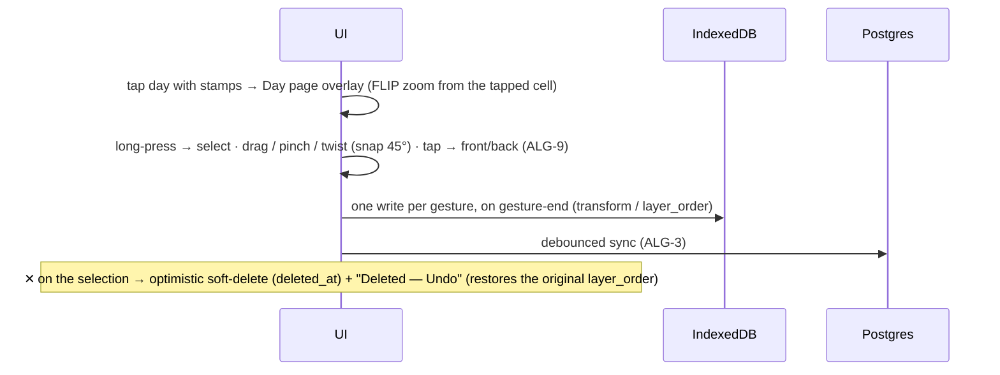
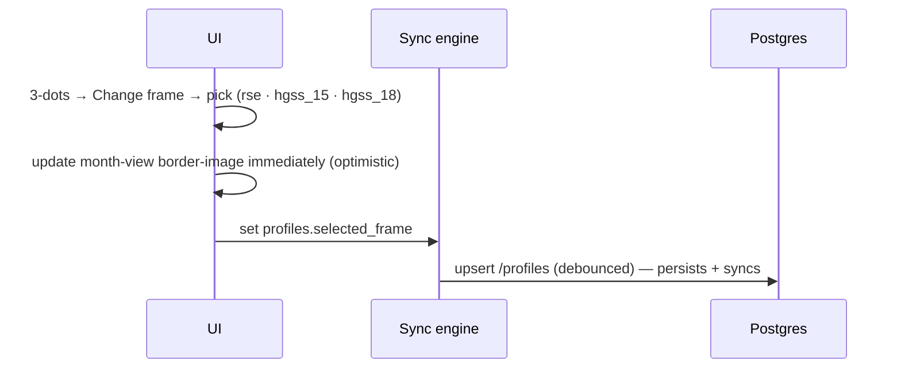

# Javi's Journal — Technical Design

Local-first, phone-first scrapbook-journal web app. Every edit renders instantly from
**IndexedDB**; a **debounced sync engine** reconciles to **Supabase** in the background
with **last-write-wins per element**. Only compressed images (~2048px) + 256px thumbnails
live in the cloud; the uncompressed original stays client-side. The signature stamp cutter
uses **canvas-based masking** (not CSS `clip-path`) for Safari/iOS consistency.

## Intra-App Interactions

The client (Next.js/React on Vercel) is the whole app: UI screens write to a local-first
IndexedDB store and render from it immediately; a sync engine debounces writes up to
Supabase Postgres; the image + cutter engine compresses/masks photos and uploads
compressed + thumbnail blobs to Supabase Storage. Two thin Next.js API routes handle the
allowlist sign-in gate and a cron health ping. Supabase provides Auth (Google + allowlist),
Postgres (RLS `auth.uid() = user_id`), and Storage (private bucket + signed URLs).



### Key flows

**FLOW-1 — Sign in, locked to Javi (US-1)**



**FLOW-2 — Add first photo → cut → place (US-6, US-7)**



**FLOW-3 — Add 2nd & 3rd stamps (US-8)**

```mermaid
sequenceDiagram
  participant UI
  participant IMG as Image+cutter
  participant ST as Storage
  participant PG as Postgres
  UI->>UI: tap day → day page overlay (the 7:6 cell zoomed); adjacent days peek (decoration, not navigable)
  UI->>UI: tap floating + FAB (bottom-right; hidden at 3 stamps)
  UI->>IMG: pick image → punch machine (drag / pinch / twist) → press the drawer → bake WebP-alpha (ALG-2)
  UI->>ST: Storage PUT baked webp closeup + thumb
  UI->>PG: POST /images (mime image/webp)
  UI->>UI: place at ~60% max-fit, cascade-offset, layer_order = max+1
  UI->>PG: upsert /stamps (entry exists) — debounced (ALG-3)
```

**FLOW-4 — Edit a day that already has stamps (US-8)**



**The day page (M6, UI)** — a **client overlay inside the Calendar island**, not a route: the calendar
(and its warm thumb handles) stays mounted underneath, view state is still never in the URL, and a
`history.pushState` guard makes the system back gesture close the day instead of leaving the app. The
page **is the 7:6 calendar cell zoomed** (`CELL_ASPECT`) — it FLIP-animates out of the tapped cell
(~250ms; `prefers-reduced-motion` or any failure → it just opens instantly, and the page never *waits*
on the animation). It has **no title**: it shows the same day-number chip `DayCell` renders, scaled up
(so nothing pops in or out of the zoom); the weekday name belongs to the calendar. Adjacent days peek
around it as static dimmed slivers reusing the month's already-resolved thumbs — **decoration, not
navigation** (no swipe-to-adjacent-day: it would fight the drag gesture). The only exits are back /
backdrop-tap → the calendar. Tapping an **empty** day never shows an empty page — it opens the OS photo
picker directly (US-7); an abandoned pick or a failed bake writes **nothing** (the `entries` row is
created lazily and atomically with the first `stamps` row).

**The calendar cell (M6)** renders the day's **faithful mini-composition** — every live stamp at its
real `pos`/`scale`/`rotation`, via the *same* `stampBoxes()` the day page uses, at 256px-thumb size.
Cell and page are both 7:6 boxes in the same normalized coordinates, so this is one layout function at
two pixel sizes.

**FLOW-5 — Silent optimistic autosave (US-11)**

```mermaid
sequenceDiagram
  participant UI
  participant IDB as IndexedDB
  participant SYNC as Sync engine
  participant PG as Postgres
  UI->>IDB: write + set client updated_at (instant, no spinner)
  UI->>UI: re-render immediately
  IDB->>SYNC: mark dirty; debounce ~800ms / gesture-end
  SYNC->>PG: batch PK upsert
  Note over SYNC: offline/error → keep dirty, "offline — will sync", backoff retry
```

**FLOW-6 — Cross-device pull + LWW merge (US-11)**

```mermaid
sequenceDiagram
  participant SYNC as Sync engine
  participant PG as Postgres
  participant ST as Storage
  participant IDB as IndexedDB
  SYNC->>PG: pull rows where updated_at > cursor (per table, ALG-4)
  SYNC->>PG: GET /images to resolve image_id → storage/thumb paths
  SYNC->>ST: createSignedUrl(s) (originals not on this device)
  SYNC->>IDB: reconcile per element (remote-newer wins; deleted_at removes)
```

**FLOW-7 — Zoom close-up ↔ full-month (US-2, US-3)** — pure client view-state, no fetch:
pinch-out → smooth scale to the full-month grid (start-of-week aware, ALG-5, fixed side
margin); pinch-in → back to close-up. The default view is chosen by pointer type
(`(pointer: coarse)` → close-up, else full-month); a 3-dots "Toggle full-month view" item is
the all-device switch. Exactly one month is mounted at a time (month navigation is fully
discrete — ALG-6). *(M4: implemented. M6 adds the tap-into-a-day overlay; while a day is open the pinch handler no-ops.)*

**FLOW-8 — Change calendar frame (US-10)**



**FLOW-9 — Month render from thumbnails (US-2, US-3, US-13)** — load entries for the visible
month range (Dexie `entry_date` range scan), mount exactly one month at a time — month
navigation is fully discrete, so there is no adjacent-month carousel (ALG-6); each day renders
a 256px thumb (object URL from IndexedDB or signed Storage URL), never full-res; every thumb
object URL is released when the month unmounts (or its stamp set changes) so memory stays flat
(fixes the ~20-day freeze).

**FLOW-10 — Download PNG (US-12)** — compose the month offscreen at 2× (9-slice frame + grid
+ thumbs + the month's stickers, ALG-7), chunked via `requestIdleCallback` so the editor never
blocks, then `convertToBlob` → download.

**FLOW-11 — Decorate a month with stickers (US-9; M7)** — the sticker button in the top bar
opens the **sticker picker as a bottom sheet** *over* the calendar (not a route, not a full
screen — she needs to see the month she is decorating while she picks), the same overlay posture
as the month picker and the 3-dots menu. It shows the **global tray** (3 seeded + everything she
has uploaded) and a leading `＋` upload tile; an upload runs through the M3 pipeline
(`ingestImage(file, 'sticker')`, PNG alpha preserved). **Tap** a tray sticker → it is placed at
the center of the *visible* part of the day grid on the **month currently shown**, arrives
**selected**, and the sheet closes (repeat taps cascade diagonally). Editing then reuses M6's
model *literally* — the same `TransformGestures` machine: long-press selects, drag / pinch /
twist (45° on release), ✕ + Undo toast, **one write per gesture**. An **unselected** sticker is
`pointer-events: none`, so a tap still opens the day underneath it and the calendar's own
one-finger scroll and pinch-to-switch behave exactly as they do with no stickers at all;
selection is what makes the layer safe to put on top of a scrolling, pinchable calendar.

## Backend API Surface

Supabase data ops go through PostgREST with RLS (`auth.uid() = user_id`); auth and storage
use the Supabase SDK; two custom Next.js route handlers cover the sign-in gate and health
ping. "UPSERT" rows are PK/uniqueness upserts driven by the sync engine.

| Method | Path | Purpose | Request | Response | Auth | Tables | Serves |
|--------|------|---------|---------|----------|------|--------|--------|
| SDK | `auth.signInWithOAuth(google)` | Google login + callback | provider | session | public → session | (auth.users) | US-1 |
| POST | `/api/auth/gate` | Allowlist/override check, provision profile | session | ok / deny | session | allowed_emails (r), profiles (w) | US-1 |
| GET | `/api/health` | Cron warm-ping (avoid free-tier pause) | — | 200 | secret header | — | US-13 |
| GET | `/entries?entry_date=gte..lte` | Month range load | date range | entries[] | yes | entries | US-2, US-3 |
| UPSERT | `/entries` (on user_id,entry_date) | Create/touch a day | entry | entry | yes | entries | US-7, US-11 |
| GET | `/stamps?entry_id=in / updated_at=gt` | Day stamps + sync delta | ids / cursor | stamps[] | yes | stamps | US-7, US-8, US-11, US-13 |
| UPSERT | `/stamps` (batch, on id) | Create/update stamp + transform | stamp[] | stamp[] | yes | stamps | US-6, US-7, US-8, US-11 |
| PATCH | `/stamps` (soft: set deleted_at) | Delete stamp (undo toast) | id, deleted_at | stamp | yes | stamps | US-8 |
| GET | `/sticker_assets?updated_at=gt` | Load the (global) tray + sync delta | cursor | assets[] | yes | sticker_assets | US-9, US-11 |
| UPSERT | `/sticker_assets` (on id) | Add an uploaded/seeded sticker to the tray | asset[] | asset[] | yes | sticker_assets | US-9, US-11 |
| PATCH | `/sticker_assets` (soft: deleted_at) | Remove a tray sticker (DB trigger rejects `is_seeded`) | id, deleted_at | asset | yes | sticker_assets | US-9 |
| GET | `/placed_stickers?updated_at=gt` | Sticker layer + sync delta | cursor | placed[] | yes | placed_stickers | US-9, US-11 |
| UPSERT | `/placed_stickers` (on id) | Place/move/resize/rotate (carries `year_month`) | placed[] | placed[] | yes | placed_stickers | US-9, US-11 |
| PATCH | `/placed_stickers` (soft: deleted_at) | Remove placed sticker | id, deleted_at | placed | yes | placed_stickers | US-9 |

**M7 (`plans/M7-PLAN.md`, the ADR of record):** `sticker_assets` is a **normal LWW table** —
`updated_at` + `deleted_at`, pushed and pulled like every other table (the old pull-only,
insert-only special case is gone). `placed_stickers` carries **`year_month`**: stickers are
**month-bounded**, not a global layer. The **tray** stays global.
| GET | `/images?id=in.(...) / created_at=gt` | Resolve image_id → storage/thumb paths (sync + 2nd device) | ids / cursor | images[] | yes | images | US-6, US-9, US-11, US-13 |
| POST | `/images` | Register row after upload | image | image | yes | images | US-6, US-7, US-9, US-13 |
| GET | `/profiles` | Load settings | — | profile | yes | profiles | US-4, US-10 |
| UPSERT | `/profiles` | Week-start · frame · fireworks_seen | profile | profile | yes | profiles | US-4, US-10 |
| PUT | `storage: images/{uid}/{id}.jpg\|.png + thumb` | Upload compressed + thumb (private bucket) | blob | path | yes (storage RLS) | (Storage) | US-6, US-7, US-9, US-13 |
| GET | `storage: createSignedUrl(s)` | Signed URL for thumb/compressed (cached) | path(s) | url(s) | yes | (Storage) | US-2, US-3, US-6, US-9 |

Notes:
- The `PATCH … deleted_at` rows depend on a schema addition — see Open Technical Questions.
- `GET /images` is required because a second device pulls `stamps`/`placed_stickers` that
  reference an `image_id` but does not hold the originals; it resolves them to
  `storage_path`/`thumb_path` to build signed URLs.

## Algorithms

### ALG-1 — Client image pipeline
- **Purpose / trigger:** on every photo/sticker upload — the "no freeze" fix + upload-size fix.
- **Runs on:** client.
- **Inputs → outputs:** a picked `File` (often 8–20MB HEIC/JPEG) → `{ mainBlob (~2048px, JPEG q0.8 for photos / PNG for stickers), thumbBlob (256px), width, height }`. The uncompressed original is kept in IndexedDB and never uploaded.
- **Approach:** transcode HEIC → JPEG (iPhone default, since Chrome/Firefox can't decode HEIC), decode via `createImageBitmap` with `imageOrientation:'from-image'` to bake EXIF rotation, stepped-halving downscale for sharpness, encode via `convertToBlob`. Stickers keep PNG alpha.
- **Pseudocode:**
  ```
  processImage(file, kind):            # 'photo' | 'sticker'
    if isHeic(file): file = await heicToJpeg(file)   # heic2any / libheif-wasm
    bmp = await createImageBitmap(file, {imageOrientation:'from-image'})
    [cw,ch] = fit(bmp.w, bmp.h, 2048)                # longest edge ≤ 2048
    main = stepDownDraw(bmp, cw, ch)                 # halving passes = sharp
    type = kind=='sticker' ? 'image/png' : 'image/jpeg'
    mainBlob  = await main.convertToBlob({type, quality:0.8})
    thumbBlob = await drawTo(main, fit(cw,ch,256)).convertToBlob({type})
    bmp.close(); release(main)                        # free memory
    return {mainBlob, thumbBlob, width:cw, height:ch}
  ```
- **Complexity / performance:** O(pixels); stepped downscale trades a few extra passes for far better quality. Close bitmaps promptly to keep memory flat.
- **Edge cases:** HEIC on non-Safari; portrait/landscape EXIF orientation; very large images on low-end phones (cap decode); transparent stickers must stay PNG.
- **Libraries:** `heic2any` or `libheif-wasm`; `createImageBitmap` / `OffscreenCanvas`.

### ALG-2 — Stamp cutter frame + destructive WebP-alpha bake  *(ADR-M5: reverses the earlier "store crop, render live" model)*
- **Purpose / trigger:** the signature feature — frame a photo behind a shape mask and **bake** it to a stamp.
- **Runs on:** client.
- **Inputs → outputs:** source image (transient, EXIF-baked) + mask id + live transform `{offX, offY, scale, rotation}` → **two baked WebP-alpha blobs** (a ~2048px closeup + a 256px grid thumb) stored via the existing `images` row + private bucket. **No crop is stored; the raw photo is discarded on confirm.** The cutter returns only `onConfirm(image_id)`.
- **Approach:** the **single render path** (`render.ts`) is used by *both* the live preview and the bake, so preview == bake by construction — this is what kills the "shifted after cutting" bug under destructive baking. The photo is drawn rotated/panned/zoomed behind an **upright** mask window, the mask alpha is applied via `globalCompositeOperation='destination-in'` (not CSS `clip-path`, inconsistent on Safari/iOS for heart / scallop / postage edges), then `mask.frame` (postage perforation) is drawn `source-over` on top. **Framing is direct manipulation** (M6): drag pans, two fingers pinch to zoom and twist to rotate — continuous, no snap (any angle is legal; the bake absorbs it). *(M5's rotate-**mode** toggle and its −/+ steppers are retired.)* The mask outline stays upright while the photo tilts. A **rotation-aware coverage clamp** (ALG-2a below) guarantees no transparent corner ever bakes. Baked as `image/webp` q0.8 with an `image/png` fallback where `convertToBlob('image/webp')` is unsupported.
- **Coverage clamp (ALG-2a, the no-blank-corner invariant):** the sampling rectangle (mask-aspect, rotated by `rotation` in source space) must stay fully inside the source image. Its axis-aligned bounding box is `W_s·|cos|+H_s·|sin|` × `W_s·|sin|+H_s·|cos|`; min-zoom is the smallest `scale` whose sampling rect's AABB still fits — a **function of rotation angle** (at 45° coverage shrinks ~√2). Entering/continuing rotate mode auto-bumps zoom to the angle's min-cover. Pan is clamped so the (rotated) sampling rect stays within the image bounds. Purely a live cut-time concern — no persistence, no sync.
- **Pseudocode (the shared render path):**
  ```
  renderFrame(ctx, img, mask, {offX,offY,scale,rotation}, size):  # size = {w,h}, w/h = mask.aspect
    Ws0 = min(img.w, img.h*mask.aspect)          # reference sampling width (fit @ rot 0)
    Ws  = Ws0 / scale;  Hs = Ws / mask.aspect     # sampling rect in source px
    cx = img.w/2 + offX;  cy = img.h/2 + offY      # sampling-rect center (source px)
    k  = size.w / Ws                               # source→canvas scale (uniform)
    ctx.translate(size.w/2, size.h/2); ctx.scale(k,k)
    ctx.rotate(-rotation); ctx.translate(-cx,-cy); ctx.drawImage(img,0,0)
    ctx.globalCompositeOperation='destination-in'; ctx.fill(mask.path(size.w,size.h))
    ctx.globalCompositeOperation='source-over'
    if mask.frame: ctx.fill(mask.frame(size.w,size.h))     # postage perforation
  bakeStamp(img, mask, transform):                 # render @ 2048 + @ 256, convertToBlob(webp,0.8)
    → { closeupBlob, thumbBlob, width, height, mime }   # png fallback; throws ImagePipelineError
  ```
- **Complexity / performance:** O(output pixels) per render; cheap enough for live preview; the bake renders twice (closeup + thumb) once, on confirm.
- **Edge cases:** image smaller than the mask window (min-cover clamp handles it); DPR is irrelevant (we bake fixed-resolution pixels, not a live transform); a decode/bake failure is **fail-closed** (throws `ImagePipelineError`, writes nothing). Because the stamp is baked, there is no "re-fit later" path — a fix is delete + re-cut from the photo (M6).
- **The machine (M6):** the cutter is presented as a **skeuomorphic punch machine** (`public/stamper/punch.webp`), full-screen over the day page. Its window is a genuine **transparent hole**, so three layers stack: the preview canvas (behind) → the machine art → the controls (`pointer-events: none` except its own controls, so gestures reach the canvas). `PUNCH_WINDOW` — one calibrated constant normalized to the asset — locates the hole, and the mask window letterboxes inside it for all 4 mask aspects (unit-tested). ‹ › chevrons in the side gutters cycle the mask; **the cut is a press on the drawer plate** (it depresses and darkens, and carries a small "cut" label — a photorealistic plate with no text is a discoverability gamble on the screen she uses daily); the stamp emerges from the slot into the drawer (the M10 flourish hangs off exactly this seam and must degrade gracefully). ✕ / the system back gesture cancels, writing nothing.
- **Libraries:** Canvas 2D / `OffscreenCanvas`; masks are SVG-path→`Path2D` alphas (crisp at any bake size).

### ALG-3 — Optimistic autosave + debounced push
- **Purpose / trigger:** every edit — "the app never makes her wait."
- **Runs on:** client.
- **Inputs → outputs:** an edited element → instant IndexedDB write + eventual Postgres upsert.
- **Approach:** write locally and re-render immediately with a client-authored `updated_at` (the LWW clock); debounce a batched flush to gesture-end / ~800ms idle; on failure keep the dirty set and retry with backoff, surfacing a subtle "offline — will sync" hint.
- **Pseudocode:**
  ```
  onEdit(el):
    el.updated_at = Date.now()          # LWW clock (client-authored)
    idb.put(el); markDirty(el); render()          # optimistic, no spinner
    debounce(flush, 800ms, {onGestureEnd:true})
  flush():
    for table, rows in groupByTable(dirty):
      try: supabase.from(table).upsert(rows)       # PK upsert
           clearDirty(rows)
      catch: keep dirty; show "offline — will sync"; backoff-retry
  ```
- **Complexity / performance:** batched network writes, one round-trip per flush per table.
- **Edge cases:** rapid gesture streams (debounce to gesture-end); partial batch failure (keep only failed rows dirty).

### ALG-4 — Pull + last-write-wins reconciliation
- **Purpose / trigger:** on app open / focus / periodic — cross-device sync.
- **Runs on:** client.
- **Inputs → outputs:** per-table `updated_at` cursor → merged IndexedDB state.
- **Approach:** incremental delta pull; per element, remote-newer wins, local-dirty-and-newer is kept (pending push wins), equal timestamps break ties by higher id (deterministic on both devices); `deleted_at` tombstones propagate deletes.
- **Pseudocode:**
  ```
  pull():
    for t in [entries, stamps, placed_stickers, profiles]:
      rows = supabase.from(t).select().gt('updated_at', cursor[t]).eq('user_id', me)
      for r in rows:
        local = idb.get(t, r.id)
        if !local or r.updated_at > local.updated_at:
          r.deleted_at ? idb.delete(t,r.id) : idb.put(t,r)
        # local dirty & newer → keep
      cursor[t] = max(seen updated_at)
    # tie (equal ts): higher id wins
  ```
- **Complexity / performance:** delta-scoped by the `(user_id, updated_at)` indexes.
- **Edge cases:** clock skew across devices (accepted for a single user on synced clocks); delete resurrection (solved by tombstones); referenced images resolved via `GET /images` + signed URLs.
- **Libraries:** supabase-js; IndexedDB (idb / Dexie).

### ALG-5 — Calendar grid with configurable week-start
- **Purpose / trigger:** rendering any month; changing start-of-week (US-4).
- **Runs on:** client.
- **Inputs → outputs:** `(year, month, startOfWeek)` → rows of 7 day-cells (with leading/trailing blanks).
- **Approach:** compute leading blanks from the ISO day-of-week of the 1st relative to the chosen start; pad to whole weeks. Re-lays-out on change; the choice persists via `profiles`.
- **Pseudocode:**
  ```
  monthGrid(year, month, startOfWeek):   # 1=Mon .. 7=Sun
    lead = (isoDow(firstOfMonth) - startOfWeek + 7) % 7
    cells = [null]*lead + [1..daysInMonth]
    while cells.length % 7: cells.push(null)      # pad trailing
    return chunk(cells, 7)                        # 5–6 rows
  ```
- **Edge cases:** months starting on the chosen start-day (lead = 0); 28–31 day months (5 vs 6 rows).

### ALG-6 — History virtualization + memory lifecycle
- **Purpose / trigger:** always, while browsing — the direct fix for the ~20-day freeze.
- **Runs on:** client.
- **Inputs → outputs:** the visible month → mounted cells with 256px thumbnails; the outgoing month's thumb object URLs released.
- **Approach (M4 realized):** mount **exactly one month at a time** — month navigation is fully discrete (long-press title / 3-dots → Change month; no swipe into an adjacent month), so the original "current ±1 month carousel" wording is superseded. Render 256px thumbnails only (object URL from IndexedDB or signed Storage URL); a whole month's thumbs are batch-resolved in one `getThumbUrls` round-trip and **every handle is released on month unmount / stamp-set change** — the deterministic release, not the LRU cap, is the mechanism (the LRU cap is only a backstop). Decode full-res originals only inside the stamper, then close the bitmap; never keep every day's canvas mounted. The `/dev/calendar` harness's object-URL canary guards that the live-URL count stays flat across many month navigations.
- **Pseudocode:**
  ```
  renderMonth(m):                        # exactly one month mounted (discrete nav)
    handles = getThumbUrls(m.imageIds)   # one batched round-trip
    for day in m.days:
         # 256px only, never full-res
  onMonthUnmount(m): for h in handles: h.release()        # release every object URL
  ```
- **M7 (stickers):** the sticker layer obeys the same rule and is **not** an exception to it —
  stickers are **month-bounded**, so the layer loads exactly the mounted month's stickers and
  releases their handles on month unmount, exactly like `useMonthData`. It renders **256px
  thumbs**, not closeups: the sticker layer *is* the month grid, and a user-uploaded sticker can
  legitimately be a 2048px alpha PNG — twenty of those held live is precisely the freeze. Object
  URLs are deduped per `image_id`, so 40 placed stickers drawn from 5 tray assets hold **5**
  object URLs. (If Tier-2 says 256px looks mushy at `MAX_SCALE`, the escape hatch is a one-line
  switch to `getCloseupUrls` — the resolver is a parameter of `useImageUrls`.)
- **Complexity / performance:** memory stays ~flat regardless of history length — the hard gate is the simulated 30–60 day long-run test.
- **Edge cases:** fast scrolling (LRU + lazy decode); missing thumb (fall back to signed Storage URL).

### ALG-7 — PNG export composition
- **Purpose / trigger:** 3-dots → Download PNG (US-12).
- **Runs on:** client.
- **Inputs → outputs:** the current month view → a downloaded PNG including frame, stickers, and thumbnails.
- **Approach:** compose offscreen at 2× — rasterize the 9-slice `border-image` frame onto the canvas, draw the grid + day thumbnails, then the month's stickers in day-grid-bbox coordinates (M7 — month-bounded, and clamped fully inside that same rect, so the export can never clip a sticker the screen showed); chunk decode/draw with `requestIdleCallback` so the editor never blocks; `convertToBlob` → download.
- **Pseudocode:**
  ```
  exportPNG(month):
    cv = OffscreenCanvas(W*2, H*2)
    draw9Slice(cv, frameAsset)               # rasterize border-image
    for cell in month.grid:
       await drawThumb(cv, cell.thumbBlob, cell.rect)
       if idleBudgetExceeded(): await nextIdle()   # requestIdleCallback
    for s in placedStickers(month): drawSticker(cv, s)   # day-grid-bbox coords (M7)
    download(await cv.convertToBlob({type:'image/png'}))
  ```
- **Edge cases:** manual 9-slice math for the frame (CSS `border-image` doesn't apply to canvas); large months chunked to stay responsive.

### ALG-8 — Auto-place + 3-cap + layer order  *(M6: constants pinned)*
- **Purpose / trigger:** placing a freshly cut stamp (US-7, US-8).
- **Runs on:** client (a Postgres `BEFORE INSERT` trigger also enforces the cap).
- **Inputs → outputs:** `(the day's existing live stamps, the baked stamp's aspect)` → `{pos_x, pos_y, scale, rotation_deg, layer_order}`.
- **The coordinate model (M6, load-bearing):** the day page **is the calendar cell zoomed** — the same
  fixed **7:6** box (`CELL_ASPECT`). `pos_x`/`pos_y` ∈ [0,1] are the stamp's **center**, and **`scale`
  is the stamp's width as a fraction of the page's width**; its height follows from the baked image's
  own aspect. Everything is normalized to that box, so a day composed on the phone renders identically
  in the calendar cell, on desktop, and in the M9 PNG export — and a stamp can never spill outside its
  day.
- **Approach:** the first stamp is centered at max-fit inside a margin; the 2nd/3rd enter smaller and
  cascade diagonally so they don't fully cover; every box is clamped back inside the page; the newest
  lands on top via `layer_order = max+1`. All tunables live in one `PLACEMENT` object
  (`src/lib/day/place.ts`) — retuning the feel is a one-object edit, and the tests assert invariants,
  not the constants.
- **Pseudocode:**
  ```
  PLACEMENT = { MARGIN: 0.06,          # of the page's shorter side
                SECOND_SCALE: 0.62,    # of maxFit, for stamps 2 and 3
                CASCADE: 0.10,         # per-stamp diagonal offset from center
                MAX_STAMPS: 3 }
  placeStamp(existing, aspect):          # existing = the day's LIVE stamps
    n = existing.length
    if n >= PLACEMENT.MAX_STAMPS: return reject()       # + the FAB is hidden at 3
    maxFit = largest w (fraction of pageW) whose w x w/aspect box fits inside the margin
    if n == 0: scale = maxFit;                        pos = {x:0.5, y:0.5}
    else:      scale = PLACEMENT.SECOND_SCALE*maxFit; pos = {x:0.5+n*CASCADE, y:0.5+n*CASCADE}
    pos = clampInsidePage(pos, scale, aspect)         # the box is ALWAYS fully on the page
    rotation_deg = 0;  layer_order = maxLayer(existing) + 1
  bringToFront(s): s.layer_order = maxLayer+1; touch(s)
  sendToBack(s):   s.layer_order = minLayer-1; touch(s)
  ```
- **Edge cases:** the 4th insert is rejected on the client **and** in the DB; a portrait stamp at
  max-fit on the landscape 7:6 page is height-bound and leaves side margins (correct and intended);
  the cascade clamp pulls a stamp back on-page rather than letting it hang off a corner.

### ALG-9 — Phone gesture disambiguation  *(ADR-M6: direct manipulation — this replaces the long-press **menu**)*
- **Purpose / trigger:** all touch interaction on the day page — the #1 phone design risk.
- **Runs on:** client.
- **Inputs → outputs:** pointer events → select · move · scale · rotate · front/back · delete.
- **Approach — select, then manipulate.** There is **no menu, no resize mode, no handles, no
  drag-to-trash**. **Long-press selects** a stamp (marked by a blue shadow underneath); *selection is
  the gate* — an unselected stamp cannot be moved, so a fat thumb can never knock a composition askew.
  On the **selected** stamp: one finger **drags**, two fingers **pinch to scale** and **twist to
  rotate**, snapping to the nearest **45°** on release (so `rotation_deg` stays legal). All clamped —
  scale ∈ [floor, maxFit], the box always inside the page. A **short tap on *any* stamp toggles
  front/back** (tap a buried stamp → it comes to the front; tap the top one → it goes to the back);
  that is the entire layer-order UI, and it needs no selection. While selected, a **✕ floats just off
  the stamp's top-right corner** (a 44px target, outside the stamp's bounds so it never blocks a
  pinch) → soft-delete + a "Deleted — Undo" toast. Tapping empty page space deselects.
  `touch-action: none` on the page; the page never scrolls or pans.
- **Hit-testing is our math, not `elementFromPoint`:** a baked heart/cloud stamp is a rectangle with
  transparent corners, so the DOM would let a top stamp's *empty* corner steal a tap from the stamp
  visibly underneath. `topElementAt(p)` inverse-rotates the point into each stamp's local space and
  takes the **highest `layer_order` whose bounding box contains it** — predictable, and correct for
  45°-snapped rectangles.
- **Pseudocode:**
  ```
  onDown(p):
    hit = topElementAt(p)                       # our math: inverse-rotate -> bbox -> top layer
    if !hit: mode='maybeDeselect'; return
    armLongPress(LONGPRESS=450)                 # -> select(hit)
    mode = (hit.id == selected) ? 'maybeDrag' : 'maybeTap'
  onMove(p):
    if dist(p, start) > SLOP(8): cancelLongPress()
    if mode=='maybeDrag' and moved:      mode='drag';      moveElement(selected, p)   # clamped
    if 2 pointers and selected:          mode='transform'; scale *= pinch; rot += twist  # live, no write
  onUp():
    if mode is a tap (no movement):      toggleFrontBack(hit)     # tap = front/back
    if mode=='maybeDeselect':            deselect()
    if mode=='transform':                rot = snap45(rot)
    if mode in {'drag','transform'}:     writeOnce(selected)      # ONE write, on gesture-end
  ```
- **Edge cases:** overlapping stamps (top by `layer_order`); accidental micro-drags (8px slop); writes
  happen **once per gesture, on gesture-end** — never per animation frame; a day-page pinch must never
  reach the calendar's pinch-to-switch (the overlay stops propagation **and** the calendar's handler
  no-ops while a day is open); must be validated on a real device.

## Open Technical Questions

- **Delete propagation (schema addition needed).** SCHEMA.md's `stamps` and `placed_stickers`
  have no `deleted_at`; the LWW sync (ALG-4) relies on a nullable `deleted_at timestamptz`
  tombstone on both so deletes propagate across devices instead of resurrecting on pull. This
  is the one change that reaches back into the schema — reconcile SCHEMA.md (a follow-up
  `/idea-db` pass) to add `deleted_at` to `stamps` and `placed_stickers`, and include it in
  the incremental-sync indexes.
- **Resolved during review:** HEIC decode (transcode on non-Safari, primary user on iPhone);
  storage privacy (private bucket + signed URLs); LWW clock skew (accepted client-authored
  `updated_at`); global sticker coordinates (normalized to the full-month grid bounding box,
  `scale` normalized to grid width, so positions are identical across close-up / full-month /
  2× PNG export).
- **`+` FAB placement.** Matched to the annotated screenshot (bottom-right); revisit if a
  bottom-left position reads better one-handed.
