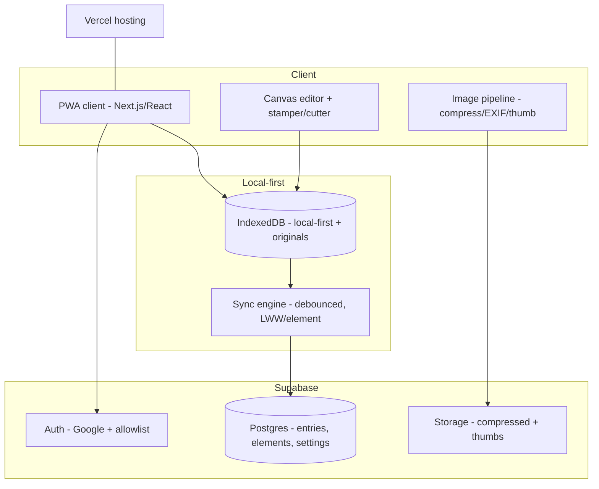
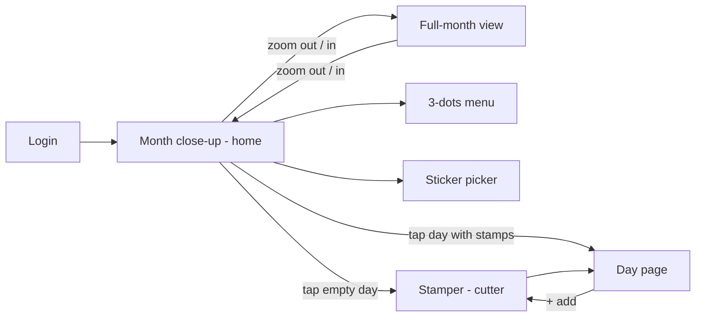
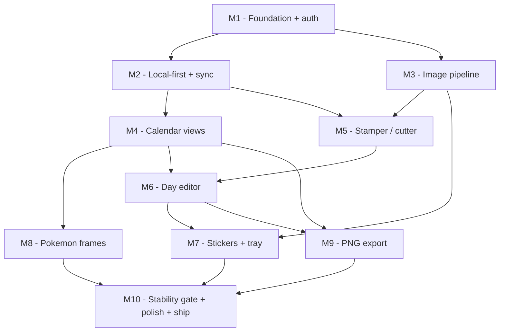

# Javi's Journal — Implementation Plan

A personal, phone-first, fully-responsive scrapbook-journal web app — a birthday gift
that turns Javi's three QueensJournal frustrations (photo resize-to-fit, week-start,
long-run freeze) into hard requirements. North star: **"the journal that never fights
her."** Ship a **birthday edition** by **2026-07-18**: a superb stamp cutter plus a
simple, reliable rest.

## Architecture / Tech Stack

A **local-first** web app. Every edit renders instantly from **IndexedDB** and a
**debounced sync engine** reconciles to **Supabase** in the background with
**last-write-wins per element**. Only compressed images (~2048px) + 256px thumbnails go
to the cloud; the true uncompressed original stays **client-side only**. The compressed
cloud image is the cross-device source of truth for non-destructive stamp re-fitting.
The cutter uses **canvas-based clipping** for final export (not CSS `clip-path`) for
Safari/iOS consistency on cloud / spiky / heart / postage-edge masks.

- **Client:** Next.js (App Router) + React + TypeScript, deployed on **Vercel**.
- **Local-first store:** IndexedDB (entries, elements, image blobs incl. originals).
- **Sync engine:** debounced push/pull to Supabase, LWW per element via `updatedAt`.
- **Image pipeline:** client-side EXIF-fix + downscale (~2048px, q0.8) + 256px thumbnail.
- **Backend:** Supabase — Auth (Google OAuth + email allowlist), Postgres (structured
  data), Storage (compressed images + thumbnails).
- **Auth gate:** server-checked multi-email allowlist + env `OWNER_OVERRIDE_EMAIL`.

## Tech Stack Decision Log
- **Next.js + Supabase + Vercel** — chose over Firebase / self-hosted Node+Postgres
  because managed auth+DB+storage with a generous free tier and one-command deploy is the
  fastest path to a real URL in ~13 days.
- **Local-first IndexedDB + debounced sync** — chose over a server round-trip per edit so
  edits render instantly on a phone; the core fix for "the app makes her wait."
- **Non-destructive cutter** — store original image ref + crop transform + mask type, not
  a baked cutout, so any stamp can be re-fit later. The compressed cloud image is the
  cross-device source.
- **Compressed-only to cloud** — only the ~2048px image + 256px thumbnail are uploaded;
  the true original stays client-side (IndexedDB). Keeps the free tier alive for years
  (~6 years at 1 photo/day; ~2 years at 3/day).
- **Long-press context menu, no drag-handles** — resize / rotate / front-back / delete are
  explicit long-press menu actions (for stamps **and** stickers), removing the
  resize-drag-vs-canvas-pan gesture conflict — the #1 phone design risk.
- **Max 3 stamps per calendar day** — bounds composition, memory, and hit-testing; keeps
  entries simple and the editor reliable. (An in-app calendar day, not a real day.)
- **Stickers = one global calendar layer** — the same stickers float across every month;
  simplest mental model, positioned in calendar coordinates, persistent + synced.
- **Rotation snapped to 8 × 45°** — chose over free rotation for both stamps and stickers;
  expressive but avoids continuous-rotation hit-testing / export-math complexity.
- **Explicit numeric layer-order field** — chose over DOM order for deterministic
  front/back sync; no full layer panel (front/back is enough).
- **Last-write-wins per element** (`updatedAt`) — chose over whole-entry LWW so a stray
  older save can't clobber a whole day; no conflict prompts.
- **Canvas clipping for cutter export** — chose over CSS `clip-path` for Safari/iOS
  consistency on heart / postage-edge / scalloped masks.
- **Virtualized history + thumbnails** — only mount on-screen days (memory stays flat) and
  load 256px thumbs in the month grid, never full-res — the direct fix for the ~20-day
  freeze.
- **Multi-email allowlist + env owner-override** — chose over a single-account guard so the
  owner can test with friends pre-launch, and a bad first mobile popup-auth can't lock Javi
  out of her own gift.

## User Stories

### US-1 — Auth locked to Javi
As Javi, I want to sign in with Google, so that only I can open my journal.

**Acceptance criteria:**
- Given an allowlisted email, when she signs in with Google, then she reaches her calendar.
- Given a non-allowlisted email, when they try to sign in, then access is denied.
- Given a failed mobile login, when the owner-override runs, then her access is restored.

### US-2 — Month close-up home view
As Javi, I want the app to open on this month with smooth sliding, so that moving around never hitches.

**Acceptance criteria:**
- Given the app opens, when it loads, then the whole current month is pre-rendered so sliding is smooth with no per-slide load hitch.
- Given the close-up view, when she slides horizontally, then it free-scrolls but is clamped so the outermost day squares never pass a fixed margin from the window edge.
- Given the top bar, when she looks, then a sticker button and a 3-dots menu are visible.

### US-3 — Full-month progress view
As Javi, I want a whole-month view that looks right on phone and desktop, so that I can watch the month fill in anywhere.

**Acceptance criteria:**
- Given the close-up view (phone), when she zooms out, then the full month grid appears with a fixed margin to the window sides.
- Given a desktop / large screen, when the app opens, then the full-month view is the default and the layout never breaks outside phone sizes.
- Given the full month, when it renders, then each day shows a progress thumbnail and a Today shortcut is available.

### US-4 — Configurable week start, opens on current month
As Javi, I want a Monday start and the app to open on the real current month, so that it matches how I think and today.

**Acceptance criteria:**
- Given defaults, when the calendar renders, then the week starts on Monday.
- Given app launch, when it opens, then it lands on the current real-time month.
- Given settings, when she changes start-of-week, then all views re-lay-out and the choice persists and syncs.

### US-5 — Change month via month name
As Javi, I want to change month by long-pressing the month name, so that navigation is obvious.

**Acceptance criteria:**
- Given close-up or full view, when she long-presses the current month's name, then a month picker opens.
- Given the 3-dots menu, when she taps "change month", then the same picker opens.
- Given a chosen month, when selected, then the view navigates there and stays put.

### US-6 — Stamper / cutter machine
As Javi, I want to fit a photo inside a stamp shape in a little stamp machine, so that it looks exactly how I want.

**Acceptance criteria:**
- Given a picked photo, when the stamper opens, then it previews inside the mask window with ‹ › controls to cycle shapes.
- Given the preview, when she pans / zooms / resizes / rotates (45°), then the photo re-fits behind the mask live.
- Given a cut, when confirmed, then the output matches the preview across zoom / pan / DPR and is stored non-destructively.
- Given the shape picker, when she cycles it, then at least 3 cut styles are available — a cloud-like scalloped edge, a spiky zig-zag edge, and a heart — alongside the classic postage-stamp frame.

### US-7 — Add and auto-place first photo
As Javi, I want one photo to be a complete entry, so that journaling stays effortless.

**Acceptance criteria:**
- Given an empty day, when she taps it, then she is sent to pick an image then the stamper.
- Given a finished stamp, when placed, then it sits centered at max size with a top/bottom margin.
- Given a one-photo day, when saved, then it counts as a complete entry with no further steps required.

### US-8 — Day editor (up to 3 stamps)
As Javi, I want to arrange up to three stamps on a day via a simple menu, so that making a page never fights me.

**Acceptance criteria:**
- Given a day, when she adds stamps, then up to 3 are allowed per calendar day; at 3 the + button is unavailable.
- Given a stamp, when she taps it she selects, drags to move, and long-presses to open a menu (Resize · Rotate 45° · Front/Back · Delete).
- Given a delete from the menu, when confirmed, then a "Deleted — Undo" toast lets her restore it; layer order is a numeric field that syncs.

### US-9 — Global calendar stickers
As Javi, I want to decorate the whole calendar with my own stickers, so that it feels like mine everywhere.

**Acceptance criteria:**
- Given the sticker button, when she uploads an image, then it's saved to her reusable tray and placeable on the calendar.
- Given a placed sticker, when she interacts, then it lives on a global layer shown on every month, can be moved / resized / rotated-45 via long-press, and freely deleted (except seeded ones).
- Given she closes and reopens the app, when it loads, then her stickers persist and sync; on day one, 3–5 seeded personal stickers are already in the tray.

### US-10 — Pokémon frame switching
As Javi, I want selectable calendar frames, so that the month view feels like mine (a hidden nod).

**Acceptance criteria:**
- Given the 3-dots menu, when she taps "change frame", then she can pick among the 3 frames.
- Given a chosen frame, when applied, then the month-view border updates and reads well on phone + desktop.
- Given a chosen frame, when she reopens the app, then it persists and syncs.

### US-11 — Silent autosave + cross-device sync
As Javi, I want edits to save instantly and follow me across devices, so that the app never makes me wait.

**Acceptance criteria:**
- Given any edit, when made, then it renders immediately with no spinner and writes to local storage.
- Given a dropped network, when she keeps editing, then a subtle "offline — will sync" hint appears and it syncs on reconnect.
- Given an edit on her phone, when she opens her desktop, then it appears there (last-write-wins per element).

### US-12 — Download PNG
As Javi, I want to save my calendar as an image, so that I can keep or share it.

**Acceptance criteria:**
- Given the 3-dots menu, when she taps "download PNG", then the current view renders to a PNG and downloads.
- Given a framed month, when exported, then the applied frame, stickers, and thumbnails are included.
- Given the export, when it runs, then it does not block or freeze the editor.

### US-13 — Long-run stability (no freeze)
As Javi, I want the app to stay fast after months of daily use, so that it never freezes like the old one.

**Acceptance criteria:**
- Given many days of entries, when browsing, then history is virtualized and never all-mounted.
- Given month view, when it renders, then only thumbnails load, never full-res images.
- Given a simulated 30–60 day run with realistic photos, when measured, then memory/FPS stay stable (hard gate).

### US-14 — Cozy cutter feedback
As Javi, I want cutting a stamp to feel satisfying, so that stamping is a little ritual.

**Acceptance criteria:**
- Given a confirmed cut, when it happens, then a stamp-cutting animation plays.
- Given the cut, when it plays, then a cutting sound plays, respecting the device's silent/mute setting.
- Given any flourish, when it runs, then it never blocks or delays the placement/save (last-mile, degrades gracefully).

## UI Screens & Flow

Grounded in the annotated Excalidraw mockup at
`C:\Users\olgui\OneDrive\Imágenes\javis-journal\Untitled-2026-07-04-2338.excalidraw`
(PNG export: `Untitled-2026-07-04-2338.png`; screen refs:
`Screenshot_2026-07-04-*.jpg`). Each day's canvas is a **vertical "story" page**.

- **Login (Google)** — must show: a Google sign-in button; denies non-allowlisted emails; owner-override recovery path. Primary action: sign in.
- **Month close-up (home)** — must show: the current month (whole month pre-rendered), day numbers, per-day stamp thumbnails, sticker button, 3-dots menu. The **fixed edge margin** = the leftmost/rightmost day-square edge is clamped to a fixed distance from the window edge. Primary actions: free-scroll L/R (clamped), tap a day, zoom-out, long-press the month name to change month. Mockup: `Untitled-2026-07-04-2338`.
- **Full-month view** — must show: the whole month grid (Monday-start) with a fixed margin to the window sides, month + year title, all day numbers, progress thumbnails, applied Pokémon frame, global stickers, Today shortcut. **On desktop this is the default view**; responsive so it never breaks at desktop sizes. Primary actions: tap a day, zoom-in, long-press month name.
- **3-dots menu** — must show: Download PNG, Logout, Toggle full-month view, Change month, Change frame. Primary action: each item (change month is also reachable by long-pressing the month name).
- **Sticker picker** — must show: reusable tray (3–5 seeded + uploaded), upload button. Primary actions: pick a sticker → add to the global calendar layer; upload a new sticker; delete non-seeded stickers.
- **Stamper (cutter) machine** — must show: a skeuomorphic stamp-machine, the photo inside the mask window, ‹ › chevrons to cycle shape, ≥3 cut styles (cloud, spiky, heart) plus the postage frame, pan/zoom/resize/rotate-45 controls, and a confirm/stamp action with a cozy cut animation + sound (US-14). Primary actions: change mask, fit, cut.
- **Day page (day close-up)** — must show: **no weekday header** — it reads as a close-up of that day **with adjacent days peeking** at the sides/top (sets up a future zoom animation); the day number, up to 3 stamps centered at max size with a margin, and a floating + button (hidden at 3 stamps). Primary actions: tap to select, drag to move, long-press menu (Resize · Rotate 45° · Front/Back · Delete), + add.
- **Birthday fireworks** — overlay on first open (last-mile, must never compete with editor reliability).

## Milestone Roadmap (DAG)

Dependencies flow along the arrows. Milestones on independent branches can be built in
parallel.

**Milestone → user stories:**
- **M1 — Foundation + auth:** US-1. Next.js on Vercel, Supabase project, Google OAuth +
  multi-email allowlist + owner-override, base data model, Storage buckets.
- **M2 — Local-first + sync:** US-11 (autosave + sync), and the sync half of US-13.
  IndexedDB models, optimistic autosave, debounced LWW-per-element sync.
- **M3 — Image pipeline:** the compression half of US-13; feeds US-6/US-7/US-9.
- **M4 — Calendar views:** US-2, US-3, US-4, US-5. Month close-up, full-month, week-start,
  change-month, Today.
- **M5 — Stamper / cutter:** US-6. Mask machine, cut styles, fit transforms, non-destructive
  storage, canvas export.
- **M6 — Day editor:** US-7, US-8. Place / select / move / resize / rotate-45 / delete,
  undo toast, front-back, +add, 3-stamp cap.
- **M7 — Stickers + tray:** US-9. Global calendar sticker layer, upload, seeded assets.
- **M8 — Pokémon frames:** US-10. Three 9-slice / `border-image` frames + frame switcher.
- **M9 — PNG export:** US-12. Render the current view → download.
- **M10 — Stability gate + polish + ship:** US-13 (hard gate), US-14 (cozy cutter),
  fireworks, pastel aesthetic, deploy, cross-device verification, seeded account,
  owner-override test.

**Parallelizable:**
- After **M1**, build **M2** and **M3** in parallel.
- After **M2**, **M4** (calendar) runs alongside the **M5 → M6** cutter/editor spine.
- **M7**, **M8**, and **M9** are independent branches that can run in parallel before
  converging at **M10**.
- **M10** is the final convergence; the long-run stability test is the hard gate and the
  cozy-cutter polish + fireworks land last.

**Frames for v1 (must-have, exactly 3):** `Frame_11_RSE`, `Frame_15_HGSS`,
`Frame_18_HGSS` from `C:\Users\olgui\Downloads\calendar frame inspo`, recreated as clean
9-slice / `border-image` pixel-art assets.

## Risks & Unknowns
- **Phone gesture conflicts** — mitigated by the long-press menu (resize/rotate are
  explicit actions, not ambient drag-handles fighting the pan), but drag-to-move vs
  canvas-scroll still needs a real-device prototype early.
- **Cutter coordinate precision** — natural vs displayed size, zoom, pan, and DPR must line
  up or the cut shifts after confirming. Main bug source; build a transform test harness.
- **Long-run freeze** — only caught by the simulated 30–60 day test; requires
  virtualization, thumbnails, object-URL revocation, and debounced saves.
- **Taste / aesthetic (surprise, no feedback loop)** — covertly gather 3–5 references of her
  style (palette, Pinterest, her QJournal pages) to de-risk "technically right but not her."
- **Auth lockout** — a bad first mobile popup-auth can't be allowed to lock her out; test the
  owner-override recovery before gifting.
- **Deadline (~13 days)** — a superb cutter + reliable core beats many half-features; keep the
  stamp-machine delightful but never at the cost of editor reliability.
- **Supabase free-tier inactivity pause** — free projects pause after 1 week of no activity.
  Daily journaling keeps it warm, but a week away (e.g. travel) sleeps it until resumed.
  Mitigation: a tiny scheduled ping (Vercel cron → a health endpoint) keeps it awake.
  Free-tier headroom is otherwise ample: 1 GB storage (~6 years at 1 photo/day), 500 MB
  Postgres (structured data is negligible), 5 GB egress/month (month view uses 30 KB
  thumbnails, so realistic use is far under).

## Testing / Validation Strategy
- **Simulated long-run test (hard gate):** script 30–60 days of entries with realistic
  8–20MB photos; confirm stable memory/FPS — the only way to catch the freeze bug without
  waiting 20 real days.
- **Real-device gesture testing** (not just a desktop mobile emulator).
- **Cutter precision:** verify cut output matches the preview across zoom / pan / DPR and
  every mask style.
- **Cross-device sync:** create on phone → appears on desktop; conflicting edits resolve per
  element.
- **Auth:** allowlist denies others; owner-override recovers a locked-out account.
- **Responsive:** month + full-month views on a real phone and desktop (incl. desktop
  defaulting to full-month); sticker persistence across reopen.
- **PNG export** produces a correct render (frame + stickers + thumbnails).
- All Success-Metrics acceptance criteria demonstrably pass before **2026-07-18**.

## First Steps
1. Scaffold Next.js + TypeScript on Vercel; create the Supabase project (Auth, Postgres,
   Storage).
2. Wire Google OAuth + the multi-email allowlist + `OWNER_OVERRIDE_EMAIL`; gate sign-in.
3. Define the data model (entries; elements with transform + mask + `layer_order` +
   `updatedAt`; global stickers; user settings) in Postgres and mirror it in IndexedDB.
4. Build the image pipeline (EXIF fix, compress ~2048px, 256px thumb) as an isolated,
   testable module.
5. Prototype the phone gesture model + the cutter coordinate transform early on a real
   device (highest-risk pieces first).
6. Stand up the month close-up view against seeded data.

## Post-launch (parked)
- **Git JSON-snapshot backup / history** — because this is effectively single-user, a
  background job (Vercel cron / serverless function) can periodically snapshot the
  **structured JSON** (entries, element transforms, layout, settings) to a **private git
  repo**, giving a versioned, browsable, revertable history of the calendar. **Images stay
  in Supabase Storage and never enter git** (binary blobs bloat history forever; Git LFS
  free quota is only 1 GB storage + 1 GB bandwidth/month). Git is not a fit as the *primary*
  live datastore (no safe in-browser push token → still needs a server; git merges fight the
  local-first LWW sync model), so this stays an additive backup layer, not a replacement.
