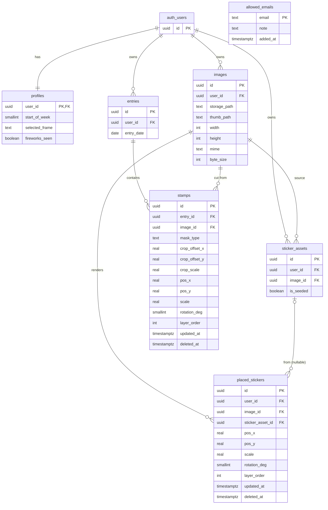

# Javi's Journal — Database Schema

PostgreSQL, hosted on **Supabase**. `auth.users` is provided by Supabase Auth;
every user-owned table references it. The client is local-first (IndexedDB) and a
debounced sync engine reconciles to these tables with **last-write-wins per element**
via a client-authored `updated_at`. Only compressed images (~2048px) + 256px thumbnails
live in the cloud (Supabase Storage); the uncompressed original stays client-side only.

## Entity–Relationship Diagram



`auth_users` is Supabase-managed (shown for context only) — it is not created by this schema.

## Tables

### allowed_emails
Supports: US-1

Server-checked Google-email allowlist gating sign-in. The owner-override recovery path is
an environment variable (`OWNER_OVERRIDE_EMAIL`), not a row here.

| Column | Type | Constraints | Notes |
|--------|------|-------------|-------|
| email | text | PK | Allowlisted Google account. |
| note | text |  | Optional label (e.g. "Javi", "pre-launch tester"). |
| added_at | timestamptz | NOT NULL, default `now()` | When the email was allowlisted. |

### profiles
Supports: US-4, US-10 (and the birthday-fireworks first-open)

Per-user settings; 1:1 with `auth.users`.

| Column | Type | Constraints | Notes |
|--------|------|-------------|-------|
| user_id | uuid | PK, FK → auth.users(id) ON DELETE CASCADE | The owner. |
| start_of_week | smallint | NOT NULL, default `1`, CHECK `between 1 and 7` | ISO day-of-week; 1 = Monday (default), changeable. |
| selected_frame | text | NOT NULL, default `'rse'`, CHECK in (`'rse'`,`'hgss_15'`,`'hgss_18'`) | The 3 Pokémon border frames. |
| fireworks_seen | boolean | NOT NULL, default `false` | Set true after the first-open birthday fireworks play. |
| created_at | timestamptz | NOT NULL, default `now()` |  |
| updated_at | timestamptz | NOT NULL, default `now()` | Client-authored on settings sync (LWW). |

### images
Supports: US-6, US-7, US-9, US-13

Registry of uploaded image assets in Supabase Storage: the compressed ~2048px image plus a
256px thumbnail. The uncompressed original never leaves the device (IndexedDB) and is
intentionally not referenced here.

| Column | Type | Constraints | Notes |
|--------|------|-------------|-------|
| id | uuid | PK, default `gen_random_uuid()` |  |
| user_id | uuid | NOT NULL, FK → auth.users(id) ON DELETE CASCADE | Owner. |
| storage_path | text | NOT NULL, UNIQUE | Path to the compressed ~2048px image. |
| thumb_path | text | NOT NULL | Path to the 256px thumbnail (month view). |
| width | int |  | Compressed image width (layout/aspect). |
| height | int |  | Compressed image height. |
| mime | text | NOT NULL, default `'image/jpeg'` | `'image/jpeg'` (photo), `'image/png'` (sticker), or **`'image/webp'`** / `'image/png'` (M5 baked stamp; ADR-M5). |
| byte_size | int |  | Compressed byte size (free-tier accounting). |
| created_at | timestamptz | NOT NULL, default `now()` |  |

### entries
Supports: US-2, US-3, US-7

One decorable day-page per calendar date per user. A "complete" entry is derived (has ≥1
stamp), not stored.

| Column | Type | Constraints | Notes |
|--------|------|-------------|-------|
| id | uuid | PK, default `gen_random_uuid()` |  |
| user_id | uuid | NOT NULL, FK → auth.users(id) ON DELETE CASCADE | Owner. |
| entry_date | date | NOT NULL, UNIQUE(`user_id`, `entry_date`) | The calendar day this page belongs to. |
| created_at | timestamptz | NOT NULL, default `now()` |  |
| updated_at | timestamptz | NOT NULL, default `now()` | Client-authored (LWW). |

### stamps
Supports: US-6, US-7, US-8, US-11, US-13

Up to 3 photo-stamps placed on a day. **Destructive (baked) cutter (ADR-M5):** the cut,
framed + masked photo is **baked to WebP-alpha pixels** and stored as its own `images` row;
a stamp references that baked image and carries only **placement** (`pos/scale/rotation_deg/
layer_order`). The crop columns below are **vestigial** under the baked model and are
scheduled for a drop in **M6** (the first writer of `stamps`); they are harmless until then,
so **no migration is on M5's path**. `mask_type` is baked into the pixels and demoted to
**optional descriptive metadata** (no longer drives rendering).

| Column | Type | Constraints | Notes |
|--------|------|-------------|-------|
| id | uuid | PK, default `gen_random_uuid()` |  |
| entry_id | uuid | NOT NULL, FK → entries(id) ON DELETE CASCADE | The day this stamp lives on. |
| user_id | uuid | NOT NULL, FK → auth.users(id) ON DELETE CASCADE | Denormalized owner (RLS + sync). |
| image_id | uuid | NOT NULL, FK → images(id) ON DELETE RESTRICT | The **baked** WebP-alpha stamp image (ADR-M5), not a raw source. |
| mask_type | text | NOT NULL, default `'postage'`, CHECK in (`'postage'`,`'cloud'`,`'spiky'`,`'heart'`,`'circle'`,`'square'`,`'oval'`) | **Vestigial / optional metadata** — the mask is baked into the pixels; kept only to describe which shape was used. |
| crop_offset_x | real | NOT NULL, default `0` | **Vestigial** (baked model — drop in M6). Was: pan X behind the mask. |
| crop_offset_y | real | NOT NULL, default `0` | **Vestigial** (baked model — drop in M6). Was: pan Y behind the mask. |
| crop_scale | real | NOT NULL, default `1`, CHECK `> 0` | **Vestigial** (baked model — drop in M6). Was: zoom behind the mask. |
| pos_x | real | NOT NULL, default `0.5` | Placement X on the day canvas (normalized). |
| pos_y | real | NOT NULL, default `0.5` | Placement Y on the day canvas (normalized). |
| scale | real | NOT NULL, default `1`, CHECK `> 0` | Placement size. |
| rotation_deg | smallint | NOT NULL, default `0`, CHECK in (0,45,…,315) | 45°-snapped rotation. |
| layer_order | int | NOT NULL, default `0` | Explicit numeric front/back (syncs deterministically). |
| created_at | timestamptz | NOT NULL, default `now()` |  |
| updated_at | timestamptz | NOT NULL, default `now()` | Client-authored, drives LWW per element. |
| deleted_at | timestamptz |  | Nullable soft-delete tombstone (NULL = live). Client-authored; lets a delete sync across devices instead of resurrecting on pull. |

Cap of ≤3 **live** stamps per `entry_id` is enforced by a `BEFORE INSERT` trigger that
counts only `deleted_at IS NULL` rows (a soft-deleted stamp frees a slot — see DDL).

### sticker_assets
Supports: US-9

The reusable sticker tray: uploaded stickers plus 3–5 seeded personal ones. Seeded assets
are protected from tray deletion.

| Column | Type | Constraints | Notes |
|--------|------|-------------|-------|
| id | uuid | PK, default `gen_random_uuid()` |  |
| user_id | uuid | NOT NULL, FK → auth.users(id) ON DELETE CASCADE | Owner. |
| image_id | uuid | NOT NULL, FK → images(id) ON DELETE RESTRICT | The sticker image. |
| is_seeded | boolean | NOT NULL, default `false` | Seeded personal sticker; cannot be deleted from the tray. |
| created_at | timestamptz | NOT NULL, default `now()` |  |

### placed_stickers
Supports: US-9, US-11

Instances of stickers on the single global calendar layer, shown across every month, in
calendar coordinates. Each instance is **self-contained**: it renders from its own
`image_id`, so deleting the source sticker from the tray never removes placed instances.

Positions are stored as fractions (0–1) of the **full-month grid bounding box** (the rect
enclosing the day cells, inside the frame) and `scale` normalized to grid width, so an
instance lands in the same spot across the phone close-up, the full-month grid, and the 2×
PNG export.

| Column | Type | Constraints | Notes |
|--------|------|-------------|-------|
| id | uuid | PK, default `gen_random_uuid()` |  |
| user_id | uuid | NOT NULL, FK → auth.users(id) ON DELETE CASCADE | Denormalized owner (RLS + sync). |
| image_id | uuid | NOT NULL, FK → images(id) ON DELETE RESTRICT | Renders independently of the tray asset. |
| sticker_asset_id | uuid | FK → sticker_assets(id) ON DELETE SET NULL | Nullable provenance; deleting the tray sticker nulls this, keeps the instance. |
| pos_x | real | NOT NULL, default `0` | Global calendar X (fraction of the grid bbox). |
| pos_y | real | NOT NULL, default `0` | Global calendar Y (fraction of the grid bbox). |
| scale | real | NOT NULL, default `1`, CHECK `> 0` | Size (normalized to grid width). |
| rotation_deg | smallint | NOT NULL, default `0`, CHECK in (0,45,…,315) | 45°-snapped rotation. |
| layer_order | int | NOT NULL, default `0` | Explicit numeric front/back (same domain as `stamps.layer_order`). |
| created_at | timestamptz | NOT NULL, default `now()` |  |
| updated_at | timestamptz | NOT NULL, default `now()` | Client-authored, drives LWW per element. |
| deleted_at | timestamptz |  | Nullable tombstone (NULL = live) for deleting a placed instance directly; syncs the delete via LWW. |

## Normalization Notes
- **Target 3NF.** Each element's transform, mask, and layer order are attributes of that
  element; there are no repeating groups or transitive dependencies.
- **Deliberate denormalization — `user_id` on child tables.** `stamps.user_id` and
  `placed_stickers.user_id` are derivable via their parents (`entries` / `sticker_assets`)
  but are replicated so every synced row carries its owner directly, keeping the RLS policy
  a single-column `auth.uid() = user_id` and avoiding a join on every sync delta.
- **Frames & week-start as scalar attributes.** `selected_frame` and `start_of_week` are
  single-valued per user and live on `profiles`. The 3 frames are a fixed `CHECK` set
  (they map to static `border-image` assets), so no lookup table is warranted.
- **Original image intentionally absent from the DB.** The uncompressed original is
  client-only (IndexedDB); Postgres syncs only the compressed + thumbnail refs. This keeps
  the Supabase free tier viable for years. For **photos** the compressed cloud image is the
  cross-device source; for **stamps** the stored artifact is the baked WebP-alpha `images`
  row (ADR-M5, destructive) — there is no re-fit path, the pixels are the source of truth.
- **`updated_at` is client-authored.** For last-write-wins per element, the client sets
  `updated_at` on write; no database trigger overwrites it (an auto-`now()` trigger would
  fight the LWW reconciliation).
- **Soft-delete tombstones.** `stamps.deleted_at` and `placed_stickers.deleted_at` are
  nullable and client-authored (like `updated_at`), NULL for live rows. They let the LWW
  sync engine propagate deletes across devices — a hard `DELETE` would vanish from the
  `updated_at` delta pull and resurrect on the other device. The stamp-cap trigger counts
  only `deleted_at IS NULL` rows. Optional housekeeping: a periodic job may hard-delete rows
  tombstoned beyond a safe window (all devices have synced by then).
- **Placed stickers are self-contained.** `placed_stickers.image_id` lets an instance render
  independently of its tray asset; `sticker_asset_id` is nullable provenance
  (`ON DELETE SET NULL`) so deleting a sticker from the tray never removes placed instances.
  This mirrors how `stamps` reference `images` directly.
- **Row-Level Security.** Every user-owned table gets RLS restricting rows to
  `auth.uid() = user_id`. `allowed_emails` is read server-side at sign-in to gate access.

## Indexes
- `entries(user_id, entry_date)` UNIQUE — one page per day, and the covering index for
  month-range scans when rendering the calendar (US-2, US-3).
- `stamps(entry_id) WHERE deleted_at IS NULL` — partial index for rendering a day's live
  stamps and the per-day thumbnails for the month grid (US-7, US-8, US-13).
- `stamps(user_id, updated_at)` — incremental sync delta pulls; intentionally returns
  tombstoned rows (a delete bumps `updated_at`) so the client can apply the removal (US-11).
- `placed_stickers(user_id, updated_at)` — load the global sticker layer and pull sync
  deltas, tombstones included (US-9, US-11).
- `sticker_assets(user_id)` — load the reusable tray (US-9).
- `images(user_id)` — per-user image lookups.

## DDL

```sql
create extension if not exists pgcrypto;

create table allowed_emails (
  email    text primary key,
  note     text,
  added_at timestamptz not null default now()
);

create table profiles (
  user_id        uuid primary key references auth.users(id) on delete cascade,
  start_of_week  smallint not null default 1 check (start_of_week between 1 and 7),
  selected_frame text not null default 'rse'
                   check (selected_frame in ('rse','hgss_15','hgss_18')),
  fireworks_seen boolean not null default false,
  created_at     timestamptz not null default now(),
  updated_at     timestamptz not null default now()
);

create table images (
  id           uuid primary key default gen_random_uuid(),
  user_id      uuid not null references auth.users(id) on delete cascade,
  storage_path text not null unique,
  thumb_path   text not null,
  width int, height int,
  mime         text not null default 'image/jpeg',  -- also 'image/png' (sticker) and 'image/webp'|'image/png' (M5 baked stamp; ADR-M5)
  byte_size    int,
  created_at   timestamptz not null default now()
);
create index images_user_idx on images(user_id);

create table entries (
  id         uuid primary key default gen_random_uuid(),
  user_id    uuid not null references auth.users(id) on delete cascade,
  entry_date date not null,
  created_at timestamptz not null default now(),
  updated_at timestamptz not null default now(),
  unique (user_id, entry_date)
);

create table stamps (
  id            uuid primary key default gen_random_uuid(),
  entry_id      uuid not null references entries(id) on delete cascade,
  user_id       uuid not null references auth.users(id) on delete cascade,
  image_id      uuid not null references images(id) on delete restrict,
  -- ADR-M5 destructive/baked cutter: image_id is the BAKED WebP-alpha stamp.
  -- mask_type is optional metadata; crop_* are vestigial and scheduled to drop in M6
  -- (M6 is the first writer of stamps; harmless until then — no migration on M5's path).
  mask_type     text not null default 'postage'
                  check (mask_type in ('postage','cloud','spiky','heart','circle','square','oval')),
  crop_offset_x real not null default 0,   -- vestigial (baked); drop in M6
  crop_offset_y real not null default 0,   -- vestigial (baked); drop in M6
  crop_scale    real not null default 1 check (crop_scale > 0),  -- vestigial (baked); drop in M6
  pos_x         real not null default 0.5,
  pos_y         real not null default 0.5,
  scale         real not null default 1 check (scale > 0),
  rotation_deg  smallint not null default 0
                  check (rotation_deg in (0,45,90,135,180,225,270,315)),
  layer_order   int not null default 0,
  created_at    timestamptz not null default now(),
  updated_at    timestamptz not null default now(),
  deleted_at    timestamptz
);
create index stamps_entry_live_idx on stamps(entry_id) where deleted_at is null;
create index stamps_sync_idx       on stamps(user_id, updated_at);

create table sticker_assets (
  id         uuid primary key default gen_random_uuid(),
  user_id    uuid not null references auth.users(id) on delete cascade,
  image_id   uuid not null references images(id) on delete restrict,
  is_seeded  boolean not null default false,
  created_at timestamptz not null default now()
);
create index sticker_assets_user_idx on sticker_assets(user_id);

create table placed_stickers (
  id               uuid primary key default gen_random_uuid(),
  user_id          uuid not null references auth.users(id) on delete cascade,
  image_id         uuid not null references images(id) on delete restrict,
  sticker_asset_id uuid references sticker_assets(id) on delete set null,
  pos_x        real not null default 0,
  pos_y        real not null default 0,
  scale        real not null default 1 check (scale > 0),
  rotation_deg smallint not null default 0
                 check (rotation_deg in (0,45,90,135,180,225,270,315)),
  layer_order  int not null default 0,
  created_at   timestamptz not null default now(),
  updated_at   timestamptz not null default now(),
  deleted_at   timestamptz
);
create index placed_stickers_sync_idx on placed_stickers(user_id, updated_at);

-- Cap: at most 3 stamps per calendar day
create or replace function enforce_stamp_cap() returns trigger as $$
begin
  if (select count(*) from stamps
        where entry_id = new.entry_id and deleted_at is null) >= 3 then
    raise exception 'A day can have at most 3 stamps';
  end if;
  return new;
end;
$$ language plpgsql;

create trigger stamps_cap_trg
  before insert on stamps
  for each row execute function enforce_stamp_cap();
```
