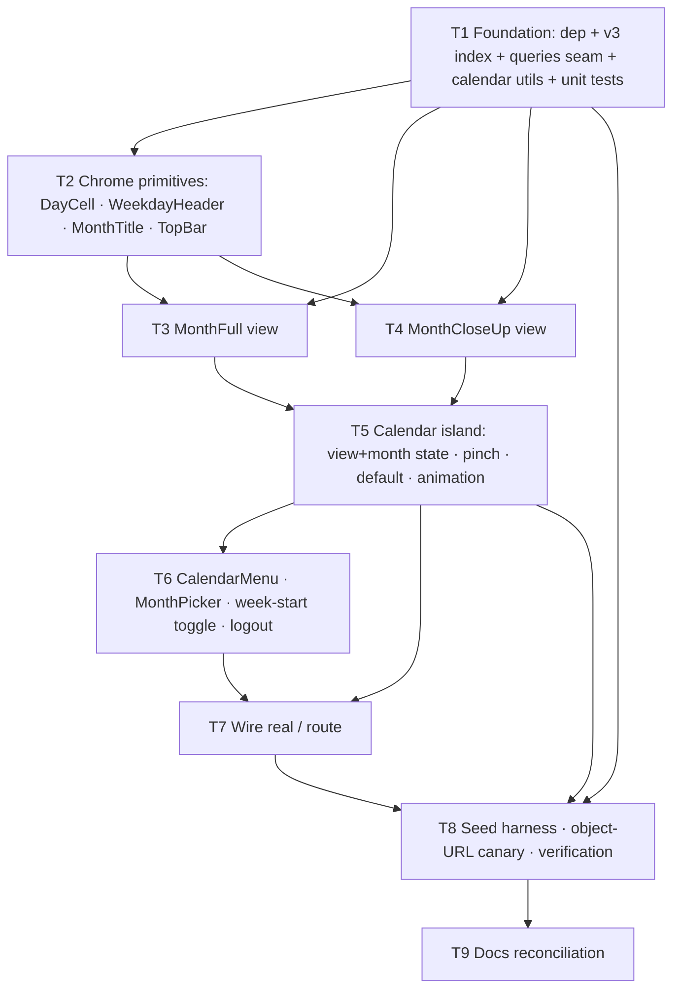

# M4 — Calendar views (US-2, US-3, US-4, US-5) — Execution Plan

Resolved via grill session 2026-07-10. This is the plan the build phase executes.

## Goal
Turn the throwaway `/preview*` prototypes into the **real, data-backed calendar** — the
app's home. M4 delivers the month **close-up** (home) view, the **full-month** view, the
pinch/menu switch between them, configurable **week-start**, **discrete month navigation**,
and the **today** marker — all reading from the local-first Dexie store and rendering day
thumbnails through M3's `getThumbUrls` helper with disciplined object-URL release.

What M4 produces:
1. A single **client calendar island** mounted at `/` (view + current month are React
   state, never URL). `/` stays a thin server component that checks auth and renders it.
2. Two real views — **`MonthCloseUp`** (column-major, free horizontal scroll, opens
   centered on today, US-2 clamp) and **`MonthFull`** (7×6 fit-to-viewport, symmetric
   margins) — sharing one fit model and cell primitive.
3. **Pinch-to-switch** (touch) + a **"Toggle full-month view"** menu item (all devices);
   default view chosen by `(pointer: coarse)`.
4. A **3-dots menu** (Toggle view · Change month · Week starts Mon/Sun · Logout) and a
   **month picker** (year stepper + 3×4 month grid, bounded `[2026-07, current month]`).
5. **Week-start** (US-4): grid computed from `profiles.start_of_week` via **ALG-5**;
   changeable Mon/Sun from the menu; persists + syncs through the M2 engine.
6. A **read seam** (`src/lib/db/queries.ts`) — the only place components touch Dexie —
   plus pure calendar utils (`month-grid.ts`, `fit.ts`, today/bounds).
7. A **dev seed harness** (`/dev/calendar`) that injects synthetic entries/stamps/image
   rows/thumb blobs so the calendar renders real thumbnails, plus an **object-URL canary**
   proving live-URL count stays flat across many month navigations (the M4 proxy for the
   US-13 freeze gate, which is formally M10).

Day-tap navigation, the day page, stamp placement, the sticker tray/layer, frames, and PNG
export are **out of scope** (M5/M6/M7/M8/M9). M4's cells are data-backed but not yet
tappable-to-navigate.

## Ground rules for every task
- **This is NOT the Next.js you know (v16.x).** Before touching `src/app/**`, read the
  relevant guide under `node_modules/next/dist/docs/`. Heed deprecation notices. The
  session-refresh proxy is `src/proxy.ts` (this version renamed `middleware.ts`).
- **Package manager is pnpm.** No npm/yarn, no `package-lock.json`.
- **Reads go through `src/lib/db/queries.ts` only.** Components never call `db.*` directly —
  mirrors how `thumb-url.ts` is the sole image-read seam. Writes (week-start) go through the
  M2 outbox (`markDirty`), never a direct Supabase call.
- **Never load full-res in the grid.** Day cells render **only** the 256px thumb via
  `getThumbUrls` (batched once per month). Release every `ThumbHandle` on month unmount.
- **Styling is Tailwind v4 CSS-first tokens** (`src/app/globals.css`), `data-theme="pastel"`.
  No CSS Modules needed in M4 (no canvas). Reuse semantic tokens (`bg-paper`, `text-ink`,
  `border-line`, `bg-today-bg`/`text-today-ink`, `font-title`, `rounded-*`).
- `pnpm lint` and `pnpm build` must pass at the end of **every** task; `pnpm test` must pass
  by the end of the last code task (T8).
- **Commit per task** with a conventional `feat:`/`chore:`/`fix:` message. **No
  `Co-Authored-By` trailer** (repo convention).
- Build **directly on the `m4-calendar` worktree off `ui-design`** — a single thread, in
  DAG order. **Do NOT use `/parallel-plan`** (codex worktree agents have failed every
  milestone on this machine). Verify each task yourself.

## Coordination with M5 (simultaneous build)
M5 (stamper/cutter) builds on a separate `m5-stamper` worktree at the same time. The likely
**shared files are `src/lib/db/index.ts` and `src/lib/db/types.ts`.**
- M4 adds a **Dexie v3 migration** (an `entry_date` index on `entries`). If M5 also bumps the
  Dexie version, **coordinate version numbers** at merge — one milestone takes v3, the other
  v4; do not both define `version(3)`. The migrations are additive and independent, so the
  merge is a renumber, not a rewrite.
- M4 does not change `types.ts`; if a merge conflict appears there it is M5's addition —
  keep both.
- **M5's destructive-cutter pivot** (stamps baked to WebP-alpha `images` rows) does not change
  M4: the day cell reads `stamp.image_id → images.thumb_path`, which exists either way. M4's
  `DayCell` thumb-selection is deliberately **isolated in one helper** so M5 can later swap the
  source to a baked stamp image when it introduces the faithful mini-composition.

## Resolved design decisions

### Routing & view-state
- **Single client island at `/`.** `/` is a server component: auth check → render
  `<Calendar/>`. No sub-routes for views or months. **View (close-up ↔ full-month) and current
  month `{year, month}` are React state** owned by `Calendar`, never in the URL (FLOW-7:
  "pure client view-state"; US-5: navigation "stays put").
- **Day-tap does nothing in M4.** Cells are data-backed and ready to become tappable in
  M5/M6; M4 wires no day navigation.
- **Keep `/preview*` exactly as-is** (dev sandbox). Real components live under
  `src/components/calendar/`.

### Data loading (reactive reads)
- **Add `dexie-react-hooks`** (`useLiveQuery`) — not currently installed. Wrap it in a typed
  seam `src/lib/db/queries.ts`:
  - `useMonthData(year, month)` → `Map<'YYYY-MM-DD', DayData>` where `DayData` carries the
    day's **top-`layer_order` live stamp** and its resolved thumb (or none).
  - `useProfile()` → the local `profiles` row, **defaulting to `start_of_week = 1`** when no
    row exists yet (first load before pull).
- **Query granularity: one `useLiveQuery` per mounted month** (keyed by year-month). It reads
  `entries.where('entry_date').between(monthStart, monthEnd, true, true)`, collects entry ids,
  reads `stamps.where('entry_id').anyOf(ids)` filtered to `deleted_at == null`, picks the top
  `layer_order` per entry, and issues **one batched `getThumbUrls`** for that month's image ids.
  Self-contained so it unmounts cleanly.
- **Reactivity for free:** when `pullAll()` mutates Dexie (sync) or M6 edits a day, the live
  query re-fires and the month re-renders. No manual invalidation.

### Virtualization & object-URL lifecycle (ALG-6, reinterpreted)
- **Month navigation is fully discrete** — long-press month name, 3-dots "Change month", or
  (implicitly) opening on the current month. There is **no swipe/scroll into an adjacent
  month**: the close-up scroll is clamped *within* the month (US-2), the full-month view has
  no scroll. So **exactly one month is mounted at a time** (at most two coexist briefly during
  the ~250ms switch animation).
- **ALG-6's "mount current ±1 month" language is superseded** for this design (it assumed a
  swipe-paged month carousel that does not exist). The real obligation is: **single mounted
  month + deterministic release-on-unmount.** A `useEffect` cleanup `release()`s every
  `ThumbHandle` the outgoing month created (revoking object URLs).
- **`thumb-url.ts`'s existing LRU cap (120 live URLs) is the backstop, not the mechanism** —
  in steady state we sit far under it because we release explicitly on unmount.
- **Object-URL canary** (T8): navigate N months in the seed harness; assert the live
  object-URL count stays flat. This is the M4 proxy for the US-13 hard gate (formally M10).
- **T9 reconciles DESIGN.md** (ALG-6 / FLOW-9 wording) to match "single mounted month."

### Day cell content ("progress thumbnail")
- **Single representative thumbnail**: the **top-`layer_order` live stamp**'s 256px thumb,
  drawn `object-fit: cover` to fill the cell, with the day-number chip on top. **No mask, no
  crop transform, no multi-stamp composition** in M4.
- **The faithful mini-composition** (all 1–3 stamps at real `pos/scale/rotation` with cutter
  masks) is **M5's** job — it depends on ALG-2 (the cutter) which does not exist in M4, and it
  keeps object-URL accounting simple. Thumb-selection is isolated so M5 can revise it.

### Geometry & fit (ported from `/preview/interactive`, as-is)
- **`monthGrid(year, month, startOfWeek)` (ALG-5)** replaces the baked `CELLS`. Returns a
  **42-cell** (fixed 6 rows) array of **date-bearing cells**:
  `type GridCell = { date: 'YYYY-MM-DD'; day: number } | null` (`null` = leading/trailing
  blank). `date` drives entry lookup, the today comparison, and (later) day navigation; `day`
  drives the number chip. Fixed 6-row pad keeps grid height stable across months.
- **`fit.ts`** — the interactive prototype's model verbatim, typed: 7:6 cells, the binding
  dimension (width on phone-portrait, height on desktop-landscape) picks
  `cellW = floor(min(widthBound, heightBound))`, leftover space → symmetric margins, 6 rows
  never scroll vertically. Measured via `ResizeObserver` (fires initial measurement on
  observe). Tiny cells on short/landscape viewports are acceptable (never scroll, just shrink).
- **Close-up**: column-major flow, ~2.5 columns visible at rest, free horizontal scroll (no
  snap), scrollbar hidden, `overscroll-behavior-x: contain`. The **US-2 clamp** is the
  scroller's fixed horizontal padding + content bounds (outermost columns rest at a fixed
  margin from the edge).
- **Full-month**: row-major 7×6, no scroll either axis, centered → symmetric margins.

### View switching & gestures
- **Two triggers only:** (1) **pinch** on touch — spread = close-up, together = full-month
  (FLOW-7), ~250ms scale+fade; (2) **3-dots → "Toggle full-month view"** on **every device**
  (the safety net for pinch discoverability, and the desktop path). **Dropped:** the
  prototype's `ctrl+wheel` (it *is* the browser's zoom control — hijacking it is hostile) and
  the dev button.
- **Default view:** close-up on `(pointer: coarse)` (touch), full-month otherwise.
- **Pinch/pan coexistence** (ported): `touch-action: none` on the calendar surface +
  `preventDefault` on 2-finger moves (we own pinch); `touch-action: pan-x` on the close-up
  scroller (1-finger still scrolls columns). `SPREAD_RATIO`/`PINCH_RATIO` thresholds carried.
- **Respect `prefers-reduced-motion`** — skip/shorten the switch animation.

### Today marker & opening on the current month
- **Today** = device-local date as `YYYY-MM-DD` (Javi's phone tz). A cell is "today" iff its
  date equals local-today **and** the displayed month is the current real month. Rendered with
  the `today-bg`/`today-ink` tokens (as in the prototype's `DayCell`).
- **Opens on the current real month** (US-4 AC-2), computed from the same local-today.
- **Close-up opens centered on today's column** (instant, no scroll animation) whenever the
  viewed month is the current month; if today is near the month edge, the clamp wins and today
  rests as centered as bounds allow. **Non-current months open left-aligned** (column 1 at the
  fixed left margin). Full-month has no scroll, so centering doesn't apply there.
- **No "Today" shortcut button** — deliberately dropped as redundant (deviation from US-3's
  literal "a Today shortcut is available"). The need is met by: opening on the current month
  centered on today, the today marker, and the change-month picker highlighting/returning to
  the current month as the "back to now" path. T9 notes this deviation in the docs.

### Week-start (US-4)
- **Honor:** `WeekdayHeader` labels + `monthGrid` leading blanks derive from
  `profiles.start_of_week` via `useProfile()`.
- **Change UI:** a **"Week starts: Mon / Sun"** control in the 3-dots menu (its natural home;
  there is no settings screen). Expose **only Mon (1) / Sun (7)** though the DB CHECK allows
  1–7 — realistically the only choices Javi wants.
- **Persist + sync:** write the local `profiles` row with a client `updated_at` and
  `markDirty("profiles", user_id, "update")`; the M2 engine syncs it. Re-layout is automatic
  via `useLiveQuery`.

### Change-month picker (US-5)
- **Overlay** (not a route): a **year stepper `‹ 2026 ›`** above a **3×4 grid of month
  names**. Tap a month → set `{year, month}`, close. Current-real-month and currently-viewed
  month get distinct highlights.
- **Triggers:** **long-press** the `MonthTitle` (≥500ms, touch) opens it; **3-dots → "Change
  month"** opens the same overlay (the desktop/discoverable path — long-press is touch-only, a
  short tap on the title does nothing). 
- **Bounds:** reachable range **`[July 2026, current real month]`** — no future months, no
  pre-epoch months. Year-stepper arrows disable at the bounds; out-of-range months render
  disabled.

### 3-dots menu scope
- **Four live items in M4:** Toggle full-month view · Change month · Week starts: Mon/Sun ·
  Logout (`supabase.auth.signOut()` → redirect `/login`).
- **Omitted until their milestone** (not shown disabled): Download PNG (M9), Change frame
  (M8). The menu component is built to be trivially extended.

### Top bar
- **Sticker button visible but inert** (US-2 AC requires it visible). Rendered as an **inline
  SVG line icon** — the WhatsApp-style sticker glyph (rounded square with a folded/peeled
  corner), stroked in `currentColor` to inherit the `ink` token and match the 3-dots weight —
  **not** the `😛` emoji from the prototype. M7 wires it to open the tray.
- **M4 renders no `placed_stickers`** — the global sticker layer is entirely M7.

### Loading & empty states
- **No blocking spinner.** Render chrome + grid immediately from whatever Dexie holds;
  thumbnails **pop in** reactively as pull writes rows (`loading="lazy"`, short opacity fade).
- **Empty day cell** (no entry / no live stamp) = day-number chip on `paper`. An empty month
  is a grid of these.
- **Missing/failed thumb** (`getThumbUrl` → `null`) = fall back to the empty numbered cell;
  never an error state in the grid.

## Component & file layout
```
src/app/page.tsx                     — server: auth check → <Calendar/>
src/app/dev/calendar/page.tsx        — dev seed harness + object-URL canary (not shipped)

src/components/calendar/
  Calendar.tsx        — top client island: {view, year, month} state, pinch gesture,
                        picker/menu open state, (pointer:coarse) default, switch animation
  MonthCloseUp.tsx    — column-major, horizontal free-scroll, center-on-today, US-2 clamp
  MonthFull.tsx       — row-major 7×6, fit-to-viewport, symmetric margins
  DayCell.tsx         — number chip + top-stamp cover thumb + today marker
  MonthTitle.tsx      — long-press (touch) → month picker
  WeekdayHeader.tsx   — labels derived from start_of_week
  TopBar.tsx          — SVG sticker icon (inert) + 3-dots menu trigger
  CalendarMenu.tsx    — Toggle view · Change month · Week starts Mon/Sun · Logout
  MonthPicker.tsx     — year stepper + 3×4 month grid, bounded [2026-07, current]

src/lib/calendar/
  month-grid.ts       — monthGrid(year, month, startOfWeek) (ALG-5); today/date/bounds utils
  fit.ts              — shared cell-fit model (7:6 cells → cellW; binding dimension)

src/lib/db/
  queries.ts          — useMonthData(year, month), useProfile(); the ONLY Dexie read seam
  index.ts            — v3 migration: entries entry_date index  (⚠ coordinate version # w/ M5)
```

## Task DAG
Built directly on `m4-calendar`, one thread, in order. `lint && build` after every task;
`test` green by T8. Conventional commit per task.



### T1 — Foundation (deps, schema, seams, pure utils + their tests)
- Add `dexie-react-hooks`.
- **Dexie v3 migration**: `entries: "id, entry_date"` (additive; index only). ⚠ Coordinate
  the version number with M5 at merge.
- `src/lib/calendar/month-grid.ts`: `monthGrid` (ALG-5), `todayISO()`, `isCurrentMonth()`,
  `monthBounds()` (picker range `[2026-07, current]`), date helpers. Pure, no React.
- `src/lib/calendar/fit.ts`: typed fit model from the interactive prototype.
- `src/lib/db/queries.ts`: `useMonthData`, `useProfile` (default `start_of_week = 1`).
- **Vitest**: `monthGrid` across both week-starts × all month shapes (28/29-leap/30/31,
  starting on each weekday) → leading blanks, 42-cell pad, correct ISO dates; today gating;
  top-stamp selection (max `layer_order`, `deleted_at` filtered, empty → none); fit math;
  picker bounds.

### T2 — Chrome primitives
- `DayCell` (number chip + `cover` thumb + today marker via tokens), `WeekdayHeader`
  (start-of-week driven), `MonthTitle`, `TopBar` (SVG sticker icon inert + menu trigger).
  Rebuilt from the `_shared.tsx` primitives, real and typed.

### T3 — MonthFull view
- Full-month 7×6 using `fit.ts` + `monthGrid` + `useMonthData`; batched thumbs; symmetric
  margins; no scroll.

### T4 — MonthCloseUp view
- Column-major scroller, ~2.5 columns, US-2 clamp (padding + content bounds),
  center-on-today (instant, current month only), hidden scrollbar, `overscroll-behavior-x`.

### T5 — Calendar island (state + gesture)
- `Calendar.tsx`: owns `{view, year, month}`; `(pointer: coarse)` default; pinch hook
  (`SPREAD_RATIO`/`PINCH_RATIO`, `touch-action` coexistence); ~250ms scale+fade respecting
  `prefers-reduced-motion`; renders the active view + `TopBar`.

### T6 — Menu, picker, settings, logout
- `CalendarMenu` (four live items), `MonthPicker` (year stepper + 3×4 grid, bounds), week-start
  Mon/Sun toggle (write profile + `markDirty`), logout (`signOut` → `/login`). Long-press on
  `MonthTitle` also opens the picker.

### T7 — Wire real `/`
- `src/app/page.tsx`: server auth check → render `<Calendar/>`. Opens on current month.

### T8 — Seed harness, canary, verification
- `/dev/calendar`: inject synthetic entries/stamps/image rows/thumb blobs into Dexie so the
  calendar renders real thumbnails; controls to add/clear data and navigate months.
- **Object-URL canary**: a test hook reading `thumb-url.ts`'s live-URL registry; navigate N
  months and assert the count stays flat. Add as an automated test where feasible +
  a harness readout.
- Full behavioral verification pass (see DoD). `pnpm test` green.

### T9 — Docs reconciliation
- Update **DESIGN.md** ALG-6 / FLOW-9 wording from "mount current ±1 month" to "single
  mounted month + release-on-unmount (discrete month nav)"; note the **dropped Today
  shortcut** deviation on US-3; note the **`entry_date` index**. Touch **PLAN.md** status +
  **SCHEMA.md** Indexes section (local `entries(entry_date)` index) as needed. Mark M4 complete
  in `AGENTS.md`/`CLAUDE.md` status.

## Definition of done

**Tier 1 — automated (`pnpm lint`, `pnpm build`, `pnpm test` all green):**
- `monthGrid` (ALG-5) unit tests across **both week-starts** and **every month shape**
  (28/29-leap/30/31, starting on each weekday): leading blanks, 42-cell pad, ISO dates.
- today util: local-date → `YYYY-MM-DD`; today-marker gated to the current month only.
- top-stamp selection: max `layer_order` among `deleted_at == null`; empty → no thumb.
- fit math: avail dims → `cellW`, binding-dimension choice.
- picker bounds: `[2026-07, current]`, arrow enable/disable.
- object-URL canary (where automatable with `fake-indexeddb`): live-URL count flat across N
  month navigations.

**Tier 2 — behavioral (harness `/dev/calendar` + real device):**
- Seeded data renders **real 256px thumbnails** in both views; **only** `getThumbUrls` thumbs
  load — never full-res.
- Object-URL count stays flat navigating many months (harness readout).
- Opens on the current month; close-up centered on today (instant); today number marked.
- Discrete month nav via long-press title (touch) and 3-dots "Change month"; bounded to
  `[2026-07, current]`; navigating away removes the today marker; picker returns to now.
- Pinch switches views on a real phone; menu "Toggle full-month view" switches on desktop;
  `prefers-reduced-motion` respected; default view correct per pointer type.
- Week-start Mon/Sun toggle re-lays-out **both** views, persists across reload, and syncs
  (outbox row created).
- Logout signs out and redirects to `/login`.
- Sticker button visible (inert); 3-dots shows exactly the four live items.
- Responsive: correct on iPhone 13 Pro Max (428×926) and desktop; layout never breaks outside
  phone sizes.

**US acceptance:** US-2, US-3, US-4, US-5 ACs demonstrably pass (with the documented
Today-shortcut deviation on US-3).

## Risks & watch-items
- **Object-URL leakage** is the single biggest reliability risk — the whole point of ALG-6.
  Release on unmount is load-bearing; the canary is the guard. Do not rely on the LRU cap
  alone.
- **`useLiveQuery` re-fire storms**: a month query re-runs on any `entries`/`stamps` mutation.
  The `entry_date` index keeps the read a range scan; keep the per-month transaction lean.
- **Dexie version collision with M5** at merge — renumber, don't rewrite (see Coordination).
- **Pinch vs horizontal pan** on real touch hardware — port the prototype's `touch-action`
  discipline exactly and validate on a real phone, not an emulator.
- **Center-on-today math** interacting with the clamp — verify at month edges (1st / 31st).
```
